# Guida allo studente

## Indice
- Pipeline di progetto
- Passi preliminari
- Comunicazione del gruppo
- Configurazione del repository su GitHub
  - Accettazione assignment e accesso al repository su GitHub
  - Creazione di un Personal Access Token e impostazione del Secret relativo per l'autenticazione del workflow su GitHub Packages
    - Creazione del Personal Access Token
    - Impostazione del GitHub Secret
  - Aggiunta del badge di GitHub Actions nel README
- Configurazione Coveralls
  - Aggiunta del badge di Coveralls nel README
- Configurazione locale del progetto
<!-- - Eseguire l'applicazione -->
- Lavoro sul codice dell’applicazione
- Test automatici e Controlli di Qualità
- Esecuzione immagine docker


## Pipeline di progetto
La creazione e l'aggiornamento degli eseguibili coinvolge una *toolchain* in *pipeline*, ovvero una serie di tool collegati in sequenza in modo che l'output del precedente sia l'input del successivo, come da figura.

Di seguito si riportano le istruzioni dettagliate per attivare la pipeline.


## Passi preliminari
È necessario effettuare l’iscrizione a diversi servizi che saranno utilizzati durante tutto lo sviluppo del progetto. In particolare:

- Iscrizione a [**Slack**](https://slack.com/) con nome, cognome e foto.
- Adesione al workspace Slack di progetto (softeng1920) mediante link mostrato dal docente a lezione.
- Iscrizione a [**github.com**](https://github.com).

In aggiunta, occorre installare i seguenti strumenti:

- [**Slack**](https://slack.com/) per desktop e mobile;
- [**Git**](https://git-scm.com/downloads);
- [**Docker**](https://www.docker.com/community-edition#/download).

Si suppone che lo studente abbia già installato sulla sua macchina l’ultima versione disponibile di **Eclipse for Java Developers**.


## Comunicazione del gruppo
* Immettere i propri dati nel form Google Drive pubblicato su Slack;
  - indicare come email quella usata o che si userà per l'iscrizione a Github.
* Scrivere nello spreadsheet associato al form il proprio GitHub username;
  - solo il cognome se non è ancora stata fatta l'iscrizione a GitHub; nel caso, in seguito aggiornare.
* Scrivere nello spreadsheet associato al form il nome del gruppo e i GitHub username dei componenti;
  - il nome del gruppo deve essere un cognome di un vincitore del Turing Award, scritto tutto in minuscolo senza spazi e caratteri speciali.
* Aggiornare il proprio profilo Slack con il nome del gruppo nel campo *What I do*.

Il nome del gruppo sarà il nome del repository su GitHub Classroom.


## Configurazione del repository su GitHub

### Accettazione assignment e accesso al repository su GitHub
Sarà necessario aspettare che il docente crei il team e il repository ad esso associato su GitHub.
Una volta creato il team, riceverete via email un invito a farne parte che dovrete accettare. 
Questo passo terminerà con successo se tutti i membri del gruppo potranno accedere al repository con URL ``` https://github.com/softeng1920-inf-uniba/progetto1920-<nome del gruppo> ```.


### Creazione di un Personal Access Token e impostazione del Secret per l'autenticazione su GitHub Packages

Il repository che vi è stato assegnato contiene tutto il necessario per cominciare lo sviluppo della vostra applicazione. Oltre a una versione base del codice sorgente, esso presenta la struttura di directory alla quale dovrete attenervi durante lo svolgimento del progetto e i file di configurazione per i principali strumenti inclusi nella pipeline. 

In particolare, in `.github/workflows`, trovate un file di configurazione di GitHub Actions, denominato `ingsw1920.yml`. [Actions](https://github.com/features/actions) è una nuova funzionalità di GitHub che consente la definizione e l'esecuzione automatizzata di pipeline di CI (Continuous Integration) e CD (Continuous Deployment). In GitHub Actions, i passaggi di una pipeline vengono specificati in un file `.yml`, detto *workflow*. Generalmente, le pipeline di CI/CD comprendono operazioni di testing, releasing e deployment di un sistema software. Nello specifico, la vostra pipeline è impostata per realizzare:

1. il testing del vostro codice (unit test con [JUnit](https://junit.org/junit5/)) e l'analisi dello stesso con strumenti di quality assurance ([checkstyle](https://checkstyle.sourceforge.io) e [spotbugs](https://spotbugs.github.io));
2. la costruzione di un eseguibile (build) a partire dai sorgenti che svilupperete;
3. la costruzione di un'immagine Docker con la vostra applicazione e il caricamento della stessa su [GitHub Packages](https://github.com/features/packages).

Il workflow predisposto in `ingsw1920.yml` delega i primi due step a [Gradle](https://gradle.org/) - sistema di build-automation adottato per questo progetto - attraverso l'invocazione del task `gradle build`; in seguito, il workflow si occupa di realizzare autonomamente il terzo step, costruendo e caricando su GitHub Packages un'immagine Docker con l'eseguibile appena assemblato. 

Affinché vada a buon fine, quest'ultimo passaggio necessita di un piccolo intervento da parte vostra, da svolgere soltanto una volta, nella fase di impostazione iniziale del progetto. Dal momento che ciascuna nuova esecuzione del workflow avviene in una macchina virtuale Ubuntu costruita ex-novo da GitHub Actions, è necessario che - ad ogni run - il processo preposto al caricamento dell'immagine Docker su Packages si autentichi al servizio (effettuando un login). Al posto della classica coppia di credenziali (username e password) è possibile usare, a questo scopo, un Personal Access Token di GitHub, da passare in input al comando che effettua la connessione a Packages. Tuttaiva, dal momento che tale comando viene riportato in chiaro nel file di workflow (`ingsw1920.yml`), passargli in input il token in modo esplicito significherebbe memorizzarne una copia che resti visibile a chiunque abbia accesso al repository; ciò non è affatto sicuro e andrebbe assolutamente evitato (un token appartiene ad uno specifico utente di GitHub e deve restare noto soltanto a lui). Per questo genere di esigenze, GitHub offre ai suoi utenti un'ulteriore funzionalità: i cosiddetti Secrets (valori crittografati associati ai repository e accessibili come variabili d'ambiente all'interno dei workflow). Una volta generato, il Personal Access può essere memorizzato in tutta sicurezza in un Secret. Al momento opportuno, il valore ivi contenuto verrà passato al comando di accesso a Packages che ne ha bisogno.

L'intervento iniziale a voi richiesto deve essere svolto da *un solo membro del team*. Egli dovrà:

- [dalle impostazioni del proprio account] creare un Personal Access Token;
- [dalle impostazioni del repository del team] generare un GitHub Secret contenente il token e un ulteriore Secret contenente il proprio GitHub username.


#### Creazione del Personal Access Token

Il membro del team con i diritti di amministratore sul repository deve:

- entrare nella pagina delle impostazioni del proprio profilo GitHub (click sull'immagine di profilo in alto a destra, poi click sulla voce *"Settings"* nel menù a tendina che compare);
  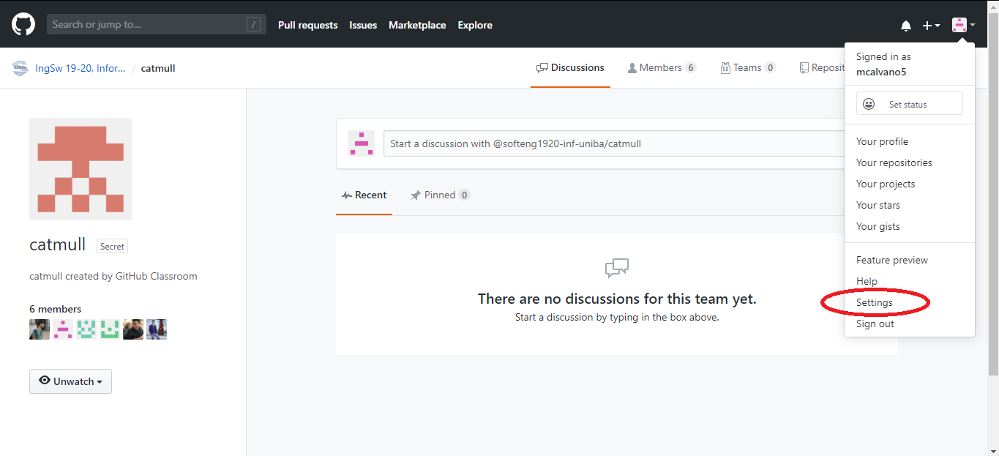

- entrare nella sezione delle impostazioni per sviluppatori, *"Developer Settings"*, facendo click sul relativo pulsante nella barra laterale;
  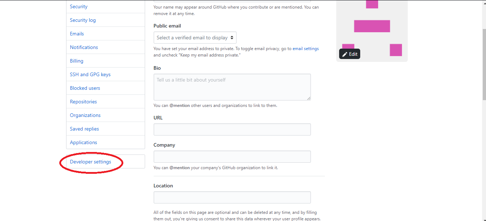

- selezionare *"Personal Access Token"* nella barra laterale e successivamente fare click su *"Generate new Token"*, in alto a destra; 
  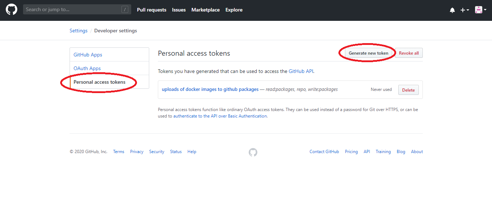

- indicare nel campo *"Note"* l'utilizzo che si intende fare del token (ad es.: *"Uploads of Docker images to GitHub Packages"*). Tale appunto tornerà utile in futuro per ricordarsi a quale scopo era stato generato il token;

- selezionare gli ambiti di validità del token (*"Scopes"*). Per consentire al processo Docker di caricare un'immagine su GitHub Packages, il set minimale di scope da abilitare è il seguente (vedi figura):

  - `repo` (con tutte le relative sotto-voci)
  - `write:packages`
  - `read:packages`

  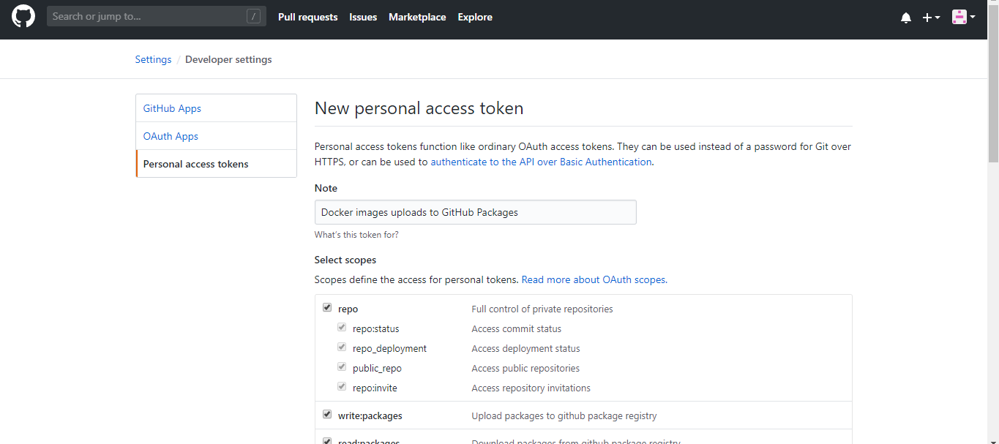

- fare click sul pulsante *"Generate token"*, in basso nella pagina;
- copiare il token che apparirà alla pagina seguente e memorizzarlo in un luogo sicuro.
  **N.B.**: non sarà più possibile visionare il token una volta usciti dalla pagina!


#### Impostazione dei GitHub Secret

A questo punto, il membro del team che ha generato il token dovrà:

- recarsi sulla pagina principale del repository e fare click sull'icona *"Settings"* (ultima tab in alto a destra);
  **N.B.**: solo l'amministratore visualizza questa tab!
  
- selezionare la voce *"Secrets"* dalla barra laterale;
  
- fare click sul link *"Add a new secret"*; compariranno una text box con l'etichetta *"Name"* e una text area con l'etichetta *"Value"*:
  - inserire la stringa `GITHUB_ACCESS_TOKEN` nella textbox con l'etichetta *"Name"*;
  - inserire il Personal Access Token precedentemente generato nella textarea con l'etichetta *"Value"*;
  - concludere l'operazione cliccando sul pulsante *"Add secret"*.
- ripetere l'operazione per l'aggiunta di un secret col proprio username: fare click sul link *"Add a new secret"*;
  - inserire la stringa `GITHUB_USERNAME` nella textbox con l'etichetta *"Name"*;
  - inserire il proprio username GitHub nella textarea con l'etichetta *"Value"*;
  - concludere l'operazione cliccando sul pulsante *"Add secret"*.

**N.B.:** È fondamentale che i nomi dei due GitHub Secret vengano scritti esattamente come sono riportati in questa guida: `GITHUB_ACCESS_TOKEN` e `GITHUB_USERNAME`(rispettando le maiuscole e gli underscore).


## Aggiunta del badge di GitHub Actions nel README
Per aggiungere il badge che riporta l'ultimo esito dell'esecuzione del workflow (stato del workflow) all'interno del file README del vostro repository, seguire le seguenti istruzioni (vedi anche [Adding a workflow status badge to your repository](https://help.github.com/en/actions/configuring-and-managing-workflows/configuring-a-workflow#adding-a-workflow-status-badge-to-your-repository)):
- entrare nella pagina principale del repository e cliccare su `Actions` (subito sotto il titolo, in alto al centro);

- *"All workflows"*, riporta l'elenco delle esecuzioni del workflow  `ingsw1920.yml` (ogni push e ogni pull request sul repository inducono una nuova esecuzione); fare click sul record relativo alla run più recente (quello più in alto) che riporta il tag `issue2` (**N.B.**: svolgendo questa operazione all'inizio del progetto, in questa lista troverete soltanto un record, quello relativo all'unica esecuzione del workflow indotta dalla creazione del repository);
  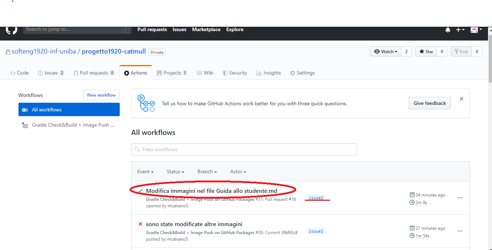
- fare click sul pulsante `Create status badge` in alto a destra nella pagina e, lasciando invariate le impostazioni di default (`branch` e `event`), fare click su `Copy status badge Markdown`;
  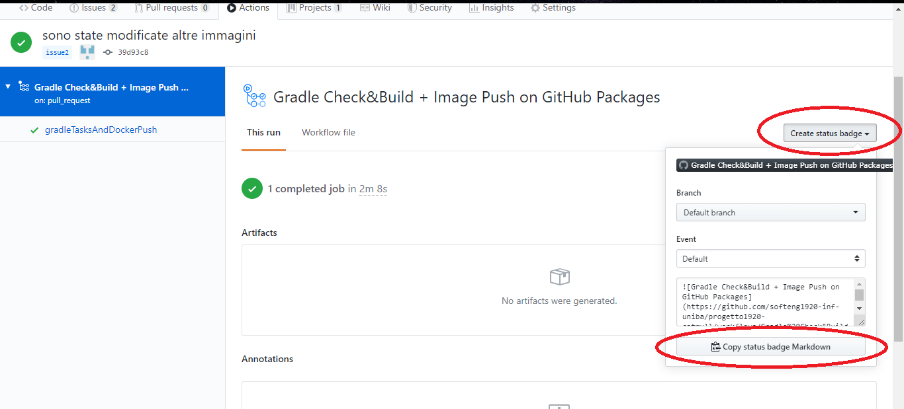
- La modifica del file Markdown `README.md`sarà fatta come parte dei task dello *Sprint 0* incollando il codice markdown per la costruzione del badge in cima al `README.md`, accanto al titolo del repository.

Il titolo del README.md dovrà apparire come nella seguente figura:


Il colore e lo stato del badge potranno cambiare dopo ogni build, riflettendo lo stato del progetto.


## Configurazione Coveralls
Coveralls è un servizio web che aiuta a monitorare nel tempo la copertura del codice di un progetto ([code coverage](https://en.wikipedia.org/wiki/Code_coverage)) e a verificare che, di volta in volta, tutto il codice che si aggiunge sia adeguatamente coperto da casi di test.

Per configurare Coveralls, collegarsi al [sito web del servizio](https://coveralls.io) ed effettuare il login tramite il proprio account GitHub. Nel menu a comparsa sulla sinistra, selezionare la voce **+ ADD REPOS**. 
Il repository `SOFTENG1920-INF-UNIBA/<nome repository>` dovrebbe essere immediatamente visibile nella pagina. Qualora non lo fosse, digitare le prime lettere del nome nel campo di testo. Se così facendo ancora non fosse visibile, andare in fondo alla pagina e cliccare sul bottone **REFRESH PRIVATE REPOS**. 
Quando la riga relativa al progetto compare, fare click sul tasto OFF per trasformarlo in ON, come mostrato in figura.

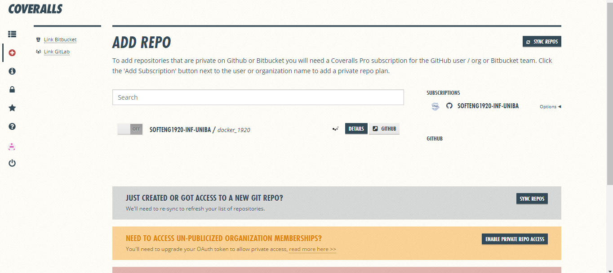

Una volta attivato il progetto, fare click su **DETAILS** per visualizzare il _token privato_ associato al repository. Questo token andrà salvato in un Secret di GitHub denominato `COVERALLS_REPO_TOKEN`, seguendo la procedura riportata al passo precedente per il salvataggio del GitHub Access Token. Più precisamente:

1. copiare il token dalla pagina dedicata al vostro repository sul sito di Coveralls;
2. fare click su "Settings" in alto a destra nella pagina dedicata al vostro repository su GitHub
   (si ricorda che soltanto il membro del gruppo con i diritti di amministratore può visualizzare questa voce di menù);
3. fare click su "Secrets" nella barra laterale e successivamente sul link "Add a new secret", riportato subito sotto `GITHUB_ACCESS_TOKEN` (il Secret con il token di accesso per GitHub Packages che avevate salvato al passo precedente);
4. avvalorare il campo `Name` con la stringa `COVERALLS_REPO_TOKEN` (da riportare letteralmente, tutta in maiuscolo come mostrata qui) e il campo `Value` con il token di Coveralls copiato al punto 1;
5. completare la procedura di inserimento del Secret facendo click sul pulsante `Add secret`, in basso nel form.

Con questi accorgimenti, ogni volta che riesegue i test il workflow sarà in grado di comunicare a Coveralls le informazioni di copertura aggiornate.


### Aggiunta del badge di Coveralls nel README

Come GitHub Actions, anche Coveralls permette di arricchire il `README` del vostro repository con un badge che rispecchia lo stato del vostro progetto, nel caso specifico riguardo la percentuale di coverage del codice.

I passi per ottenere il badge di Coveralls sono i seguenti:

- tornare sulla pagina "Details" dedicata al vostro repository sul sito di Coveralls (dove avete copiato il token). In uno dei riquadri in alto nella pagina è riportato il badge da aggiungere al README. Fare click sul tasto `EMBED` (vd. figura); 
  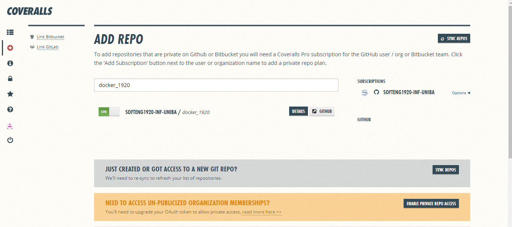
- copiare il codice markdown per la richiesta del badge;
  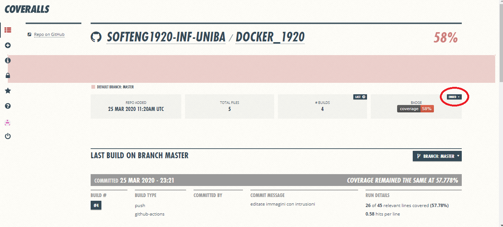
- La modifica del file Markdown `README.md`sarà fatta come parte dei task dello *Sprint 0* incollando il codice markdown per la costruzione del badge in cima al `README.md`, accanto al titolo del repository.
- Alla fine, il file `README.md` dovrà mostrare due badge, simili a quelli riportati nella figura sottostante:


#### Troubleshooting

Qualora doveste accorgervi che il badge con il coverage non si aggiorna - nonstante le modifiche ai casi di test - potete forzare il refresh aggiungendo `&service=github` al link, come mostrato di seguito:

```
[](https://coveralls.io/github/softeng1920-inf-uniba/base1920?branch=master)
```


## Configurazione locale del progetto
Per rendersi operativi con il progetto in locale, occorre seguire questi passi.

**Clonazione della repository remota**

Come prima attività, è necessario clonare la repository remota sulla propria macchina. Procedere come segue:

- Individuare la posizione nel proprio file system dove clonare la cartella di progetto. *Per evitare successivi problemi con l'importazione di Eclipse, evitare di salvare la cartella di progetto nella root del workspace di Eclipse*;
- Da terminale (Unix) o prompt dei comandi (Windows) spostarsi attraverso il comando *cd* nella cartella scelta al passo precedente;
- Scrivere il comando `git clone <url>` , dove l’url è quello visibile da GitHub premendo il bottone *Clone or Download*, in alto a destra nell’interfaccia. Ad esempio:

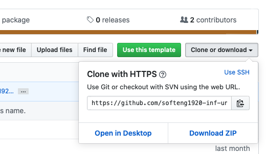

Se l’operazione è andata a buon fine, siamo quasi pronti per partire… Ma prima, è necessario importare il progetto in Eclipse!

**Configurazione di Eclipse**

Assicuarsi di aver installato [Java versione 8](https://www.oracle.com/technetwork/java/javase/overview/index.html) ed [Eclipse IDE for Java](https://www.eclipse.org/downloads/) versione 2019-12 (4.14.0) o superiore.

<!-- ###### Installazione Google Cloud Tools

Dopo aver completato l'installazione, avviate Eclipse. Quindi, selezionate la voce del menu `Help > Eclipse Marketplace`.  Nella finestra, effettuate la ricerca delle parole chiave *Google cloud* per far comparire la componente *Google Cloud Tools for Eclipse*  come da figura.


Completate l'installazione e riavviate. -->

**Importazione del progetto in Eclipse**

Per importare correttamente il progetto in Eclipse, si dovrà seguire solo un semplice accorgimento: anziché creare un progetto Java (scelta di default), si opterà per la creazione di un progetto Gradle. Più nel dettaglio:

- Da *File* selezionare la voce *Import* per importare il progetto;
- Selezionare sotto la cartella *Gradle*, la voce *Existing Gradle Project*


- Dopo aver superato l’eventuale *Welcome*, bisognerà specificare come *Project root directory* la cartella di progetto clonata al passo precedente;
- A questo punto terminare l’operazione con *Finish*.


**Modifica della cartella di default per javadoc**

La cartella di default per la generazione di *javadoc* è la cartella `doc`. Per conformità con la struttura della repository di base del progetto, dovremo modificare il percorso e puntare a `nomeprogetto/doc/javadoc`:

- Premere il tasto destro sulla cartella di progetto di Eclipse. Scegliere quindi l’opzione *Properties*, in coda al menù contestuale.
  
- Individuare, tra le proprietà, quella denominata *Javadoc Location*.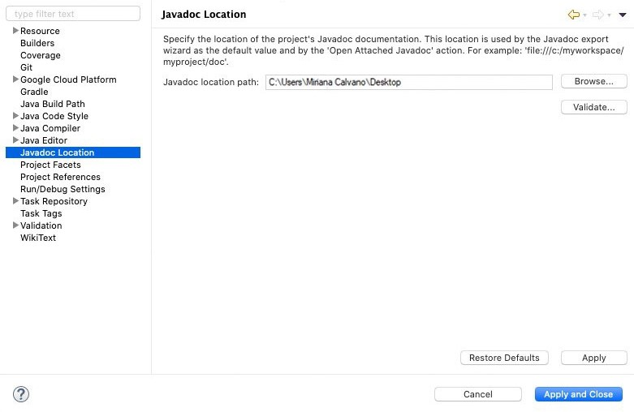

- Tramite il pulsante *Browse*, selezionare il percorso `doc/javadoc` all’interno della cartella di progetto.
- Chiudere la finestra con *Apply and Close*.

<!-- ###### Verifica setup librerie

Verificate la presenza delle librerie nel build path di Java.

Come prima, premere il tasto destro sulla cartella di progetto di Eclipse. Scegliere quindi l’opzione *Properties*, in coda al menù contestuale;


Quindi, selezionate la voce `Java Build Path` e verificate le seguenti librerie siano presenti come in figura. Qualora mancassero, procedete ad aggiungerle premendo il bottone `Add JARs…`. I file `jar` richiesti sono salvati nella cartella `<nomeprogetto>/libs`.


Se dovesse invece mancare la voce *Google Cloud Platform Libraries*, aggiungetela premendo sul task *"Add Library…"*.


Quindi, premete su *"Finish"*, senza selezionare alcuna voce.

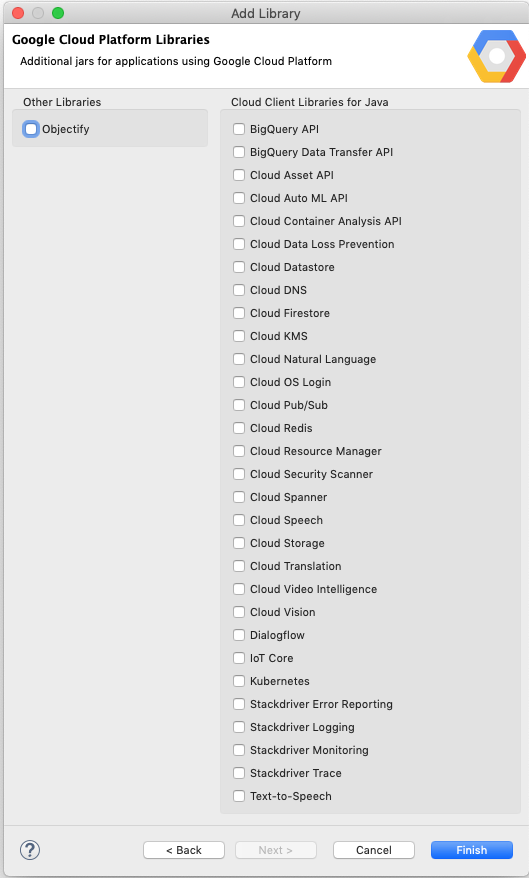 -->


<!-- ## Eseguire l'applicazione

#### Attivare Google Service Account 

Questi passi devono essere eseguiti da un solo componente del gruppo di progetto. 

1. Collegarsi alla [Piattaforma Google Cloud](https://console.cloud.google.com/home/dashboard) (è richiesta autenticazione tramite account Google).

2. Create un nuovo progetto con il nome ***scacchi***, come in figura. L'altro campo non è necessario.
   

3. Assicuratevi che il progetto sia selezionato nella dashboard, dopodiché dal menu a sinistra selezionate la voce `API e servizi > Libreria`.
   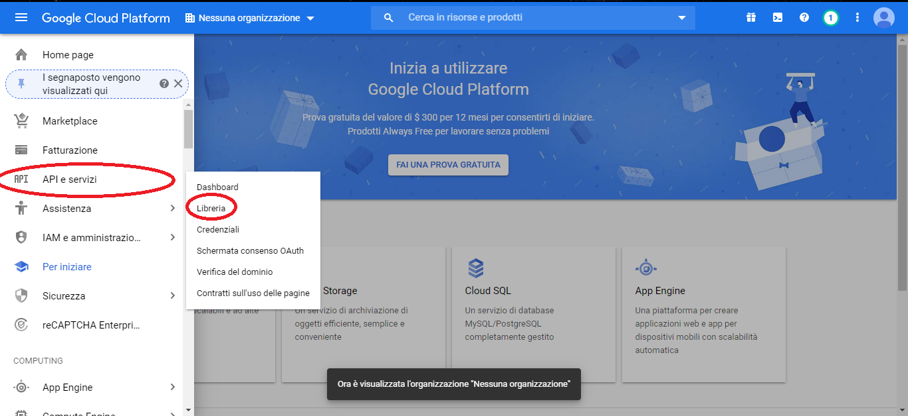

4. Cercate e selezionate l'API di ***Drive*** (`Google Drive API`), quindi attivatela premendo il tasto `Abilita`, nella pagina dedicata.

5. Sempre dal menu a sinistra, selezionate la voce `API e servizi > Credenziali`.
   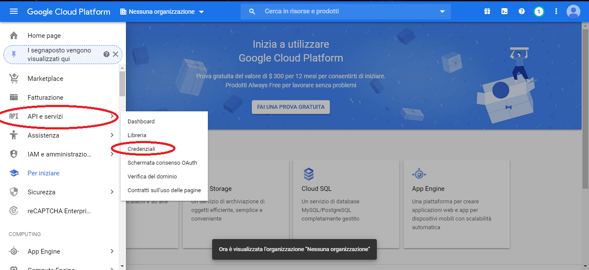

6. Fate click sul pulsante **"CREA CREDENZIALI"** e successivamente sulla voce **"Account di servizio"**.
   

7. Compilate i campi del wizard per la creazione dell'account di servizio come riportato nelle figure a seguire.
   **N.B.**: il valore del campo `ID account di servizio` è generato automaticamente. Bisogna annotare, invece, l'**ID di progetto**, evidenziato in rosso nella figura sottostante (in questo caso `scacchi-271210`), compreso tra il simbolo `@` e il resto della stringa `.iam...`.

   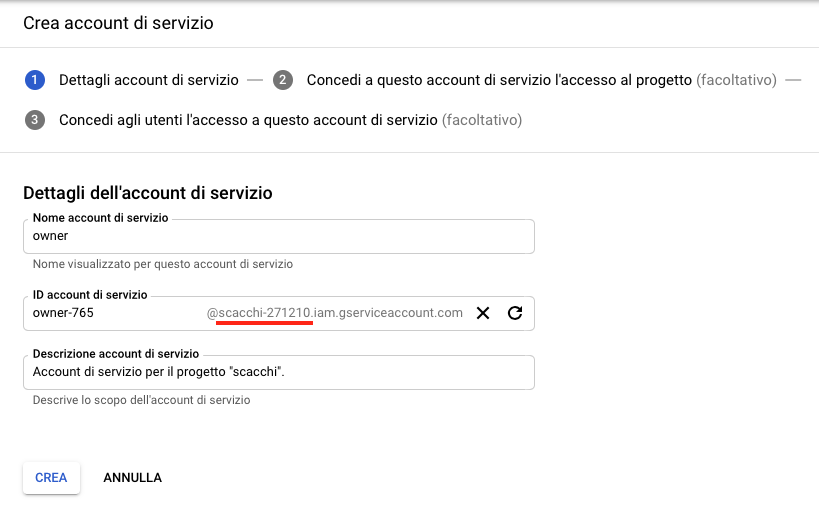

   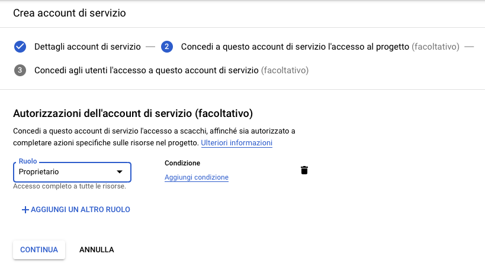

   Prima di completare la procedura con un click sul pulsante "Fine", fate click su **"CREA CHIAVE"** e procedete con la creazione di una chiave in formato JSON.
   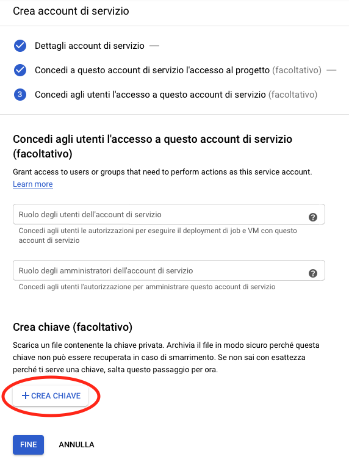

8. Rinominate il file JSON utilizzando il nome del vostro progetto; per esempio, se fate parte del progetto ***Allen***, la chiave dovrà chiamarsi `project-allen.json`.

9. Via Slack, inviate la chiave a Fabio Calefato ***come messaggio privato***.

10. Il file sarà accessibile all'URL nel formato `http://neo.di.uniba.it/credentials/ID-hash.json`, che vi sarà inviato in risposta al messaggio.

11. L'URL precedente sarà impiegato nelle classi Java che necessiteranno di una connessione all'API di Google Cloud Platform (ad esempio per usufruire dei servizi di Google Drive).

12. È possibile che alcuni metodi dell'API richiedano l'ID del progetto: è quello annotato nel passo 7.

13. Posizionatevi sul file `AppMain.java` ed eseguite come Java application da Eclipse. -->


## Lavoro sul codice dell’applicazione

Il workflow da utilizzare è il [GitHub Flow](https://guides.github.com/introduction/flow/) e prevede essenzialmente i seguenti passi:

- Subito prima di lavorare sul codice, è opportuno eseguire una `git pull` e lavorare sul codice più aggiornato
- Per ogni nuova *feature* *user story* o *bug fix* occorre creare o scegliere l’issue su cui lavorare su GitHub e segnarsi come **assigned**
- Creare un nuovo **branch** sul repository locale con il numero dell'issue o il titolo come nome del branch (*issue#n* oppure *titoloissue*) attraverso il comando `git branch <nome branch> `
- Spostarsi sul nuovo branch appena creato con il comando `git checkout <nome branch>` 	
- Lavorare al codice dell’applicazione. È consigliabile fare piccole **commit** autoconsistenti di volta in volta, con uno scopo ben preciso ed una descrizione dettagliata. *Evitare di fare un’unica grande commit alla fine del lavoro, a meno che la feature o il bug fix non sia davvero di poco conto.*
- Aggiorna con regolarità il branch sul server origin in GitHub con il comando `git push origin <nome branch>`
- Quando la modifica è stata correttamente implementata, si consiglia di scrivere adeguati test di unità per validarne la correttezza.
- Dopo l’esecuzione dei test è possibile lanciare gli strumenti di **Quality Assurance** (checkstyle e findbugs) per assicurarsi di aver scritto codice di qualità. Leggere la sezione *Controlli di Qualità* per ulteriori informazioni.
- A questo punto, dunque, si può procedere all'apertura di una pull request, andando su GitHub e posizionandosi sul branch su cui si sta lavorando.
- Scrivere un titolo conciso ed esplicativo per la pull request e una descrizione significativa per il revisore come commento, incluso un riferimento all'issue nella forma *closes #n*. Scegliere almeno un reviewer tra i componenti del team.
- Una volta lanciata la pull request, si attiverà la costruzione automatica della build e ci sarà da attendere qualche minuto. In caso di conflitti, bisogna risolverli. Può essere utile consultare la documentazione di GitHub (<https://help.github.com/articles/about-merge-conflicts/>) e comunicare con chi ha effettuato le modifiche in conflitto.  
- Discutere eventuali commenti dei reviewer e apportare le modifiche se necessarie come commit sul branch di lavoro. Ricordare che i commit aggiuntivi vanno comunque propagati sul repository remoto in GitHub mediante comando `git push origin <nome branch>`.
- Ricevuta l'approvazione esplicita di almeno un componente del team, si può procedere da GitHub al merge del nuovo *branch* con il *master branch* sul repository remoto.
- Se la build GitHub Actions e il merge su GitHub sono entrambi andati a buon fine, per completare il lavoro, cancellare il branch sul repository remoto (mediante interfaccia web di GitHub) e sul repository locale con la sequenza di comandi: `git checkout master`, `git pull` e `git branch -d <nome branch>`.


## Test automatici e Controlli di Qualità

È possibile misurare la copertura dei test automatici e operare dei controlli statici sulla qualità del codice Java (QA, quality assurance), grazie a strumenti come *JUnit*, *JaCoCo*, *Checkstyle*, *Spotbugs*. Per lanciarli in un colpo solo si può utilizzare *Gradle*.

- Assicurarsi che sia aperta la vista *Gradle Tasks* in Eclipse. In caso negativo, dal menù *Window*, selezionare *Show View* e poi *Other*. La vista si troverà sotto la voce *Gradle*. Nell’eventualità che la vista non compaia, provare a cambiare *perspective* su Eclipse e selezionare *Java EE*: ciò si può fare o premendo Java EE dal bottone in alto a destra o da menù *Window-\>Perspective-\>Open Perspective-\>Other* e poi *Java EE*.
- Selezionare il nome del progetto e, tra le diverse opzioni, *verification*.
- Avviare il controllo attraverso l’operazione di **check**, che eseguirà automaticamente sia la build del progetto, sia i test di unità, sia i controlli di qualità.
- Aggiungere al controllo di versione la cartella `build/reports/` (**non** tutta la cartella `build/`), contenente i report degli strumenti.


- Per verificare gli errori, eventualmente individuati dagli strumenti di QA, si deve aprire la vista *Console*.

**N.B.** Nella configurazione attuale del progetto la presenza di errori non impedisce la corretta compilazione del codice. Si suggerisce, tuttavia, di limitare il più possibile *warnings* ed *errori* segnalati da questi strumenti.


## Esecuzione immagine docker

Dopo ogni operazione di push o pull request sul repository, GitHub Actions tenta di compilare l’applicazione e, in caso di successo, esegue test e controlli di quality assurance. Nel caso in cui la compilazione e i test siano andati a buon fine, GitHub Actions  ha il compito di caricare l’immagine del container su GitHub Packages. Per essere certi che il codice non presenti problemi, occorre scaricare l’immagine da GitHub Packages ed eseguire il container mediante l’installazione locale di Docker.

Si svolgano le seguenti operazioni:

- avviare Docker localmente (una volta aperta l’applicazione, bisogna attendere che nel menu di Docker compaia la scritta “Docker is running”);

- se si utilizza Windows selezionare `Switch to Linux containers` nel menu di Docker;

- recarsi alla pagina principale del repository su GitHub e fare click sul link *"package"*, nella barra evidenziata in figura;
   **N.B.**: se i Secret menzionati in questa guida sono stati impostati correttamente e se almeno un'esecuzione del workflow di GitHub Actions è andata a buon fine, il numero a sinistra del link dovrebbe indicare la presenza di 1 package nel repository.
   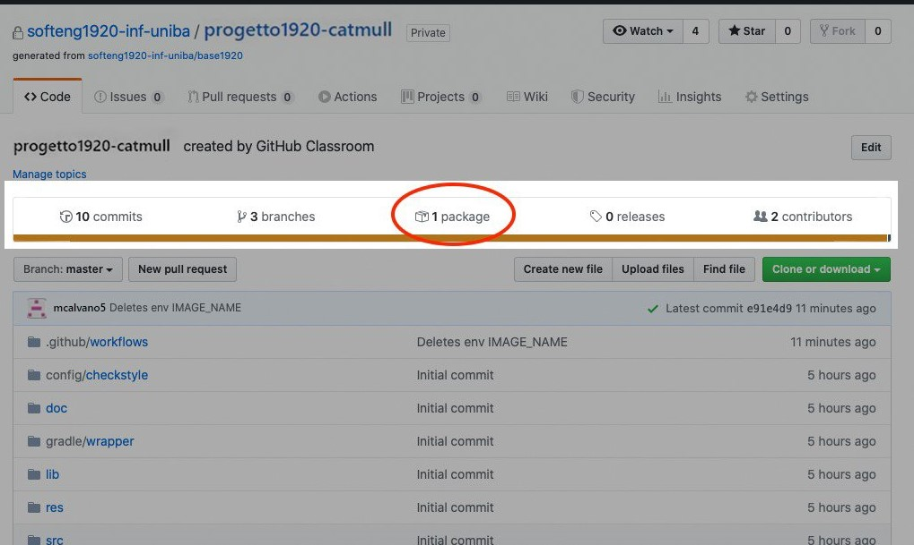

- nella pagina successiva, fare click sul link del package che riporta il nome del vostro team;

- nella pagina dedicata al package è indicato il comando da copiare ed eseguire nel terminale per scaricare l'immagine Docker in locale.
   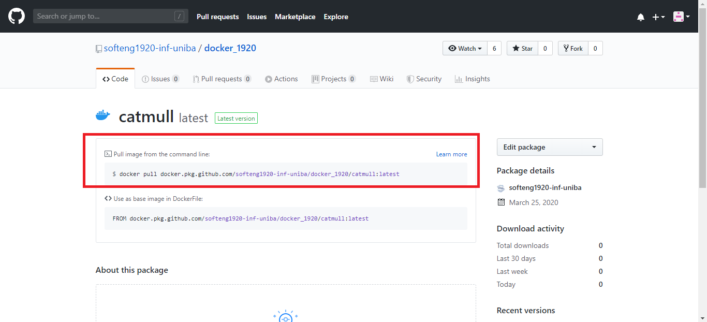
   
- incollare ed eseguire il comando nel terminale. Attendere che Docker scarichi l’immagine dell’applicazione

- digitare infine il comando:

	`docker run -it --rm <nome_immagine>`

	dove per `<nome_immagine>` si intende l'url riportato nel comando precedente, immediatamente dopo le prime due parole (`docker pull`).
	

Ad esempio, se il comando precedente (copiato da GitHub dal riquadro mostrato in figura), è:
```
docker pull docker.pkg.github.com/softeng1920-inf-uniba/provaprogetto1920-prova/prova:latest
```

il comando per eseguire il container sarà:

```
docker run -it --rm docker.pkg.github.com/softeng1920-inf-uniba/provaprogetto1920-prova/prova:latest
```

(in altre parole, il secondo comando si ottiene dal primo sostituendo a `docker pull` le parole `docker run -it --rm`).

**N.B.**: in caso di necessità, avete la possibilità di passare parametri alla vostra applicazione aggiungendo stringhe in coda al comando `run`. Per esempio:

		docker run -it --rm <nome_immagine> help

**N.B.:** l’opzione `—-rm` serve per far sì che Docker interrompa l’esecuzione del container nel momento in cui l’applicazione eseguita al suo interno termina;

le opzioni `-i` e `-t` hanno invece, rispettivamente, le seguenti funzioni:
- `-i` (abbreviazione di `--interactive`) serve a richiedere un’esecuzione interattiva del container;
- `-t` (abbreviazione di `--tty`) serve ad allocare uno pseudo-tty (una sorta di terminale virtuale) connesso allo standard input (genericamente, la tastiera del computer).

In sostanza si richiede a Docker di eseguire interattivamente il container, specificando la sorgente di input per la sessione interattiva.