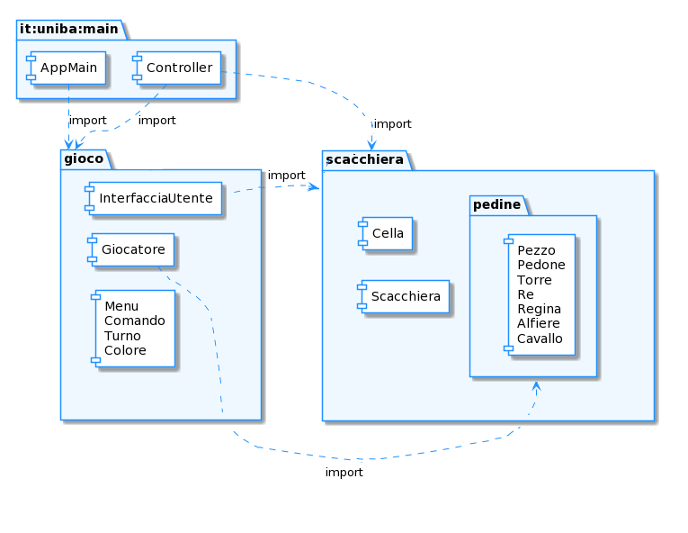

# Report
  
  
**Indice**
1. [Introduzione](#intro)
1. [Modello di dominio](#dom_mod)
1. [Requisiti specifici](#spec_req)
	- [Requisiti funzionali](#func_req)
	- [Requisiti non funzionali](#not_func_req)
1. [System Design](#sys_des)
	- [Stile architetturale adottato (opzionale)](#arch_style)
	- [Diagramma dei package, diagramma dei componenti (opzionali)](#pkg_cmpnts_diag)
	- [Commentare le decisioni prese (opzionale)](#comments1)
1. [OO Design](#oo_design)
	- [Diagrammi delle classi e diagrammi di sequenza *(per le user story considerate più importanti)*](#class_seq_diag)
	- [Menzionare l'eventuale applicazione di design pattern *(opzionale)*](#design_patt)
	- [Commentare le decisioni prese *(opzionale)*](#comments2)
1. [Riepilogo del test](#test_recap)
	- [Riportare la tabella riassuntiva di coveralls (o jacoco), con dati sul numero dei casi di test e copertura del codice](#coverall_stats)
1. [Manuale utente](#user_man)
1. [Processo di sviluppo e organizzazione del lavoro](#dev_proc)
1. [Analisi retrospettiva](#retro_analysis)
	* [Cosa vi ha fatto sentire soddisfatti e vi ha reso contenti](#happy)
	* [Cosa vi ha fatto sentire insoddisfatti e vi ha deluso](#sad)
	* [Cosa vi ha fatto «impazzire» e vi ha reso disperati](#crazy)

#  Introduzione

[Torna all'indice](#indice)

# Modello di dominio

[Torna all'indice](#indice)

# Requisiti specifici

#### Requisiti funzionali

#### Requisiti non funzionali

[Torna all'indice](#indice)
# System Design

#### i.Diagramma dei package

[Torna all'indice](#indice)

# OO Design
#### Diagrammi delle classi e diagrammi di sequenza
##### User story "<titolo>"

#### Menzionare l'eventuale applicazione di design pattern
#### Commentare le decisioni prese

[Torna all'indice](#indice)

# Riepilogo del test
#### Tabella riassuntiva di coveralls (o jacoco), con dati sul numero dei casi di test e copertura del codice

Sono stati generati i test automatici tramite il testing framework open source di Java: JUnit. La copertura del codice scritto è pari all' 80%.

 

Seguono le immagini tratte dal report dei test automatici di Coveralls.

Le uniche classi escluse dai casi di test sono “InterfacciaUtente” e ”AppMain” poiché sono di tipo Boundary. Queste classi hanno l’esclusivo compito di comunicare con l’utente attraverso messaggi visualizzati a schermo oppure mediante richieste di inserimento da tastiera, dunque i test sui flussi di input e output sarebbero stati superflui, in quanto propri di Java. 

La copertura della classe Controller è parziale poiché è stata esclusa la funzione playGame(), in quanto richiama i metodi della classe InterfacciaUtente e utilizza metodi già testati separatamente.  

  

[Torna all'indice](#indice)

# Manuale utente

[Torna all'indice](#indice)

# Processo di sviluppo e organizzazione del lavoro

# Analisi retrospettiva
#### Cosa vi ha fatto sentire soddisfatti e vi ha reso contenti
#### Cosa vi ha fatto sentire insoddisfatti e vi ha deluso
#### Cosa vi ha fatto «impazzire» e vi ha reso disperati

[Torna all'indice](#indice)
