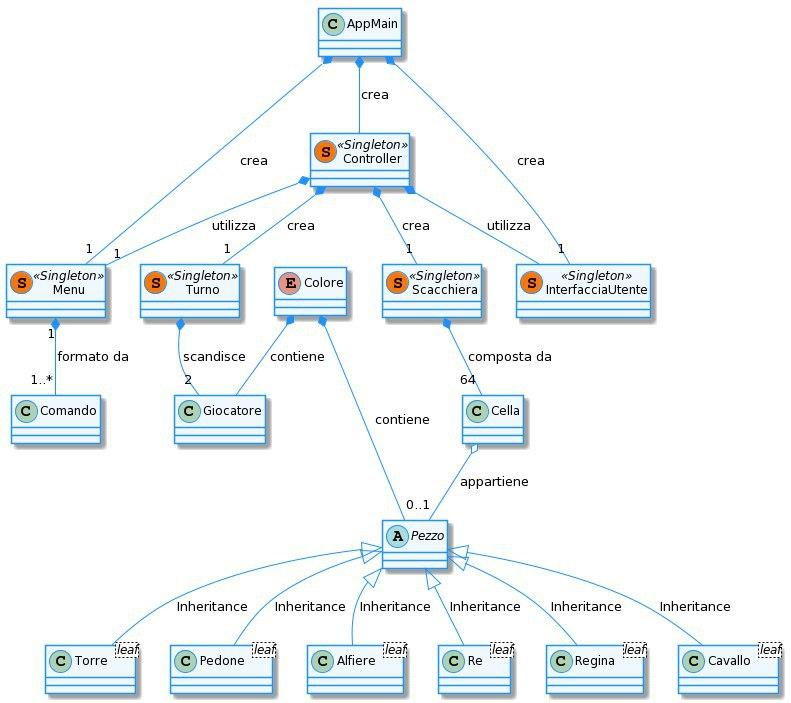

# Report
  

**Indice**
1. [Introduzione](#intro)
1. [Modello di dominio](#dom_mod)
1. [Requisiti specifici](#spec_req)
	- [Requisiti funzionali](#func_req)
	- [Requisiti non funzionali](#not_func_req)
1. [System Design](#sys_des)
	- [Stile architetturale adottato (opzionale)](#arch_style)
	- [Diagramma dei package, diagramma dei componenti (opzionali)](#pkg_cmpnts_diag)
	- [Commentare le decisioni prese (opzionale)](#comments1)
1. [OO Design](#oo_design)
	- [Diagrammi delle classi e diagrammi di sequenza *(per le user story considerate più importanti)*](#class_seq_diag)
	- [Menzionare l'eventuale applicazione di design pattern *(opzionale)*](#design_patt)
	- [Commentare le decisioni prese *(opzionale)*](#comments2)
1. [Riepilogo del test](#test_recap)
	- [Riportare la tabella riassuntiva di coveralls (o jacoco), con dati sul numero dei casi di test e copertura del codice](#coverall_stats)
1. [Manuale utente](#user_man)
1. [Processo di sviluppo e organizzazione del lavoro](#dev_proc)
1. [Analisi retrospettiva](#retro_analysis)
	* [Cosa vi ha fatto sentire soddisfatti e vi ha reso contenti](#happy)
	* [Cosa vi ha fatto sentire insoddisfatti e vi ha deluso](#sad)
	* [Cosa vi ha fatto «impazzire» e vi ha reso disperati](#crazy)

# Introduzione

[Torna all'indice](#indice)

##  i. &#160; Cenni storici

Il **gioco degli scacchi** è un gioco di strategia in cui due giocatori fronteggiano
i rispettivi eserciti, composti da pedine aventi specifiche diverse,
su un apposito campo di battaglia meglio conosciuto come scacchiera.
La locuzione deriva dal persiano Shah che significa Re, e, in seguito a diversi
adattamenti, si è diffuso nel Sud Europa con il vocabolo di origine catalana escac.
Successivamente al suo avvento il gioco si è proliferato sempre di più impegnando ogni
ambito e ogni ceto possibile, dai ceti bassi fino alla nobiltà, dalla letteratura fino
al cinema. Banalmente si trattava di un forma del gioco ancora primitiva e priva di tutte
le regole di cui oggi siamo a conoscenza. Infatti, fu a partire dal 1400 che furono
introdotte nuove regole, vedi l'arrocco, e furono attribuite nuove qualità a ciascun
pezzo. Una di queste novità riguarda la possibilità da parte del pedone di compiere un
movimento tale da farlo spostare di due case se e solo se questo debba effettuare il
suo primo movimento di tutta la partita. 250 anni dopo fu pubblicato un libro dallo
scrittore Francois-Andrè-Philidor dal nome "L'analyze des Echecs" che affronta per la
prima volta le strategie di gioco e fu davvero una svolta per quel periodo in quanto
l'opera risultò col tempo essere rimarchevole per lo sviluppo dello studio degli scacchi. Di qui a breve vennero inventate
 le prime forme di notazione, tra queste, la notazione descrittiva poi sostituita da quella che utilizziamo ancora oggi conosciuta come notazione algebrica, introdotta da Philipp Stamma nel 1737.

Per quanto riguarda la scacchiera, trattasi di una griglia quadrata costituita da 64 celle o case di cui 32 bianche e 32 nere.
L'obiettivo del gioco è quello di muovere le pedine in modo da condurre il Re avversario nella condizione di non poter più effettuare alcuna mossa valida,ovvero lo **Scaccomatto**. Non è consentito lasciare il proprio Re sotto attacco, esporre il proprio Re all’attacco e nemmeno ‘catturare’ il Re avversario.
L’avversario il cui Re sia stato posto in scaccomatto ha perso la partita.
Se la posizione è tale che nessuno dei due giocatori possa in alcun modo dare
scaccomatto al Re avversario, la partita è patta.
Preliminarmente gli avversari hanno rispettivamente 16 pezzi di colore bianco
e 16 pezzi di colore nero.

I pezzi sono i seguenti:
<ul>
    <li><b>otto</b> pedoni bianchi e <b>otto</b> pedoni neri;</li>
    <li><b>due</b> Cavalli bianchi e <b>due</b> Cavalli neri;</li>
    <li><b>due</b> Alfieri bianchi e <b>due</b> Alfieri neri;</li>
    <li><b>due</b> Torri bianche e <b>due</b> Torri nere;</li>
    <li><b>una</b> Donna bianca e <b>una</b> Donna nera;</li>
    <li><b>un</b> Re bianco e <b>un</b> Re nero.</li>
</ul>

<i>Scacchiera con pezzi allo stato iniziale</i>

##  ii. &#160; Obiettivi

Lo scopo principale di questa relazione è quello di realizzare un'applicazione in grado di
simulare il gioco degli scacchi secondo il regolamento tradizionale. Per fare ciò
è stato utilizzato il linguaggio di programmazione orientato agli oggetti, ovvero, Java al fine di consentire uno
sviluppo di alto livello.

## iii. &#160; Schema della relazione

La relazione da qui in poi si sviluppa come segue:
<ul>
<li>il capitolo 2 rappresenta il Modello di dominio con particolare riferimento alle classi
principali utilizzate e i collegamenti funzionali tra di esse;</li>

<li>il capitolo 3 rappresenta i requisiti specifici enfatizzando le caratteristiche del software,
facendo un'accurata distinzione tra <b>requisiti funzionali</b> e <b>requisiti non funzionali</b>;</li>

<li>il capitolo 4 è quello del System Design che consente di comprendere come è strutturato il
progetto con relative rappresentazioni grafiche;</li>

<li>il capitolo 5 è quello del OO Design in cui vengono mostrati i diagrammi delle classi e diagrammi di sequenza;</li>

<li>il capitolo 6 fa riferimento al riepilogo del test in cui vengono riportati i casi di test con
relativa copertura del codice;</li>

<li>il capitolo 7 riguarda il Manuale dell' utente che gestisce il funzionamento dell'applicazione
agevolando l'utente nel suo utilizzo;</li>

<li>il capitolo 8 è legato al processo di sviluppo e organizzazione del lavoro che elenca i
processi di sviluppo dell' intero progetto e i principi secondo cui ciò è stato fatto;</li>

<li>il capitolo 9 è quello conclusivo in cui vengono analizzati i traguardi personali raggiunti
ed eventuali aspetti considerati poco motivanti. </li>
</ul>

# Modello di dominio

[Torna all'indice](#indice)

# Requisiti specifici

#### Requisiti funzionali

#### Requisiti non funzionali

[Torna all'indice](#indice)
# System Design

#### Stile architetturale adottato (opzionale)
#### Diagramma dei package, diagramma dei componenti (opzionali)
#### Commentare le decisioni prese (opzionale)

[Torna all'indice](#indice)

# OO Design
#### Diagrammi delle classi e diagrammi di sequenza
##### User story "<titolo>"

#### Menzionare l'eventuale applicazione di design pattern
#### Commentare le decisioni prese

[Torna all'indice](#indice)

# Riepilogo del test
#### Tabella riassuntiva di coveralls (o jacoco), con dati sul numero dei casi di test e copertura del codice

[Torna all'indice](#indice)

# Manuale utente

[Torna all'indice](#indice)

# Processo di sviluppo e organizzazione del lavoro

[Torna all'indice](#indice)

# Analisi retrospettiva
#### Cosa vi ha fatto sentire soddisfatti e vi ha reso contenti
#### Cosa vi ha fatto sentire insoddisfatti e vi ha deluso
#### Cosa vi ha fatto «impazzire» e vi ha reso disperati

[Torna all'indice](#indice)
