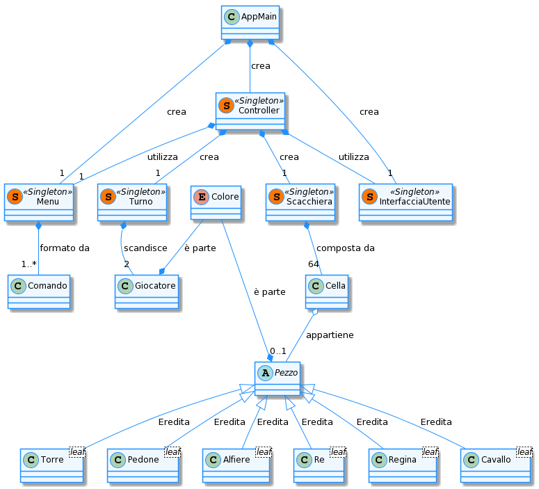

# Report
  

**Indice**
1. [Introduzione](#intro)
1. [Modello di dominio](#dom_mod)
1. [Requisiti specifici](#spec_req)
	- [Requisiti funzionali](#func_req)
	- [Requisiti non funzionali](#not_func_req)
1. [System Design](#sys_des)
	- [Stile architetturale adottato (opzionale)](#arch_style)
	- [Diagramma dei package, diagramma dei componenti (opzionali)](#pkg_cmpnts_diag)
	- [Commentare le decisioni prese (opzionale)](#comments1)
1. [OO Design](#oo_design)
	- [Diagrammi delle classi e diagrammi di sequenza *(per le user story considerate più importanti)*](#class_seq_diag)
	- [Menzionare l'eventuale applicazione di design pattern *(opzionale)*](#design_patt)
	- [Commentare le decisioni prese *(opzionale)*](#comments2)
1. [Riepilogo del test](#test_recap)
	- [Riportare la tabella riassuntiva di coveralls (o jacoco), con dati sul numero dei casi di test e copertura del codice](#coverall_stats)
1. [Manuale utente](#user_man)
1. [Processo di sviluppo e organizzazione del lavoro](#dev_proc)
1. [Analisi retrospettiva](#retro_analysis)
	* [Cosa vi ha fatto sentire soddisfatti e vi ha reso contenti](#happy)
	* [Cosa vi ha fatto sentire insoddisfatti e vi ha deluso](#sad)
	* [Cosa vi ha fatto «impazzire» e vi ha reso disperati](#crazy)

<ol>
<li>

# Introduzione

[Torna all'indice](#indice)

##  i. &#160; Cenni storici

Il **gioco degli scacchi** è un gioco di strategia in cui due giocatori fronteggiano
i rispettivi eserciti, composti da pedine aventi specifiche diverse,
su un apposito campo di battaglia meglio conosciuto come scacchiera.
La locuzione deriva dal persiano Shah che significa Re, e, in seguito a diversi
adattamenti, si è diffuso nel Sud Europa con il vocabolo di origine catalana escac.
Successivamente al suo avvento il gioco si è proliferato sempre di più impegnando ogni
ambito e ogni ceto possibile, dai ceti bassi fino alla nobiltà, dalla letteratura fino
al cinema. Banalmente si trattava di un forma del gioco ancora primitiva e priva di tutte
le regole di cui oggi siamo a conoscenza. Infatti, fu a partire dal 1400 che furono
introdotte nuove regole, vedi l'arrocco, e furono attribuite nuove qualità a ciascun
pezzo. Una di queste novità riguarda la possibilità da parte del pedone di compiere un
movimento tale da farlo spostare di due case se e solo se questo debba effettuare il
suo primo movimento di tutta la partita. 250 anni dopo fu pubblicato un libro dallo
scrittore Francois-Andrè-Philidor dal nome "L'analyze des Echecs" che affronta per la
prima volta le strategie di gioco e fu davvero una svolta per quel periodo in quanto
l'opera risultò col tempo essere rimarchevole per lo sviluppo dello studio degli scacchi. Di qui a breve vennero inventate
 le prime forme di notazione, tra queste, la notazione descrittiva poi sostituita da quella che utilizziamo ancora oggi conosciuta come notazione algebrica, introdotta da Philipp Stamma nel 1737.

Per quanto riguarda la scacchiera, trattasi di una griglia quadrata costituita da 64 celle o case di cui 32 bianche e 32 nere.
L'obiettivo del gioco è quello di muovere le pedine in modo da condurre il Re avversario nella condizione di non poter più effettuare alcuna mossa valida,ovvero lo **Scaccomatto**. Non è consentito lasciare il proprio Re sotto attacco, esporre il proprio Re all’attacco e nemmeno ‘catturare’ il Re avversario.
L’avversario il cui Re sia stato posto in scaccomatto ha perso la partita.
Se la posizione è tale che nessuno dei due giocatori possa in alcun modo dare
scaccomatto al Re avversario, la partita è patta.
Preliminarmente gli avversari hanno rispettivamente 16 pezzi di colore bianco
e 16 pezzi di colore nero.

I pezzi sono i seguenti:
<ul>
    <li><b>otto</b> pedoni bianchi e <b>otto</b> pedoni neri;</li>
    <li><b>due</b> Cavalli bianchi e <b>due</b> Cavalli neri;</li>
    <li><b>due</b> Alfieri bianchi e <b>due</b> Alfieri neri;</li>
    <li><b>due</b> Torri bianche e <b>due</b> Torri nere;</li>
    <li><b>una</b> Donna bianca e <b>una</b> Donna nera;</li>
    <li><b>un</b> Re bianco e <b>un</b> Re nero.</li>
</ul>

<i>Scacchiera con pezzi allo stato iniziale</i>

##  ii. &#160; Obiettivi

Lo scopo principale di questa relazione è quello di realizzare un'applicazione in grado di
simulare il gioco degli scacchi secondo il regolamento tradizionale. Per fare ciò
è stato utilizzato il linguaggio di programmazione orientato agli oggetti, ovvero, Java al fine di consentire uno
sviluppo di alto livello.

## iii. &#160; Schema della relazione

La relazione da qui in poi si sviluppa come segue:
<ul>
<li>il capitolo 2 rappresenta il Modello di dominio con particolare riferimento alle classi
principali utilizzate e i collegamenti funzionali tra di esse;</li>

<li>il capitolo 3 rappresenta i requisiti specifici enfatizzando le caratteristiche del software,
facendo un'accurata distinzione tra <b>requisiti funzionali</b> e <b>requisiti non funzionali</b>;</li>

<li>il capitolo 4 è quello del System Design che consente di comprendere come è strutturato il
progetto con relative rappresentazioni grafiche;</li>

<li>il capitolo 5 è quello del OO Design in cui vengono mostrati i diagrammi delle classi e diagrammi di sequenza;</li>

<li>il capitolo 6 fa riferimento al riepilogo del test in cui vengono riportati i casi di test con
relativa copertura del codice;</li>

<li>il capitolo 7 riguarda il Manuale dell' utente che gestisce il funzionamento dell'applicazione
agevolando l'utente nel suo utilizzo;</li>

<li>il capitolo 8 è legato al processo di sviluppo e organizzazione del lavoro che elenca i
processi di sviluppo dell' intero progetto e i principi secondo cui ciò è stato fatto;</li>

<li>il capitolo 9 è quello conclusivo in cui vengono analizzati i traguardi personali raggiunti
ed eventuali aspetti considerati poco motivanti. </li>
</ul>
</li>
<li>

# Modello di dominio

[Torna all'indice](#indice)

</li>
<li>

# Requisiti specifici
I requisiti specifici rappresentano le caratteristiche del software. Difatti, la formulazione di essi è utile ai progettisti per soddisfare le richieste del committente e dell'utente.  
I requisiti si suddividiono in funzionali e non funzionali: i requisiti funzionali descrivono i servizi, o funzioni, offerti dal sistema, mentre i requisiti non funzionali definiscono i vincoli sui servizi offerti dal sistema, e sullo stesso processo di sviluppo.
<ol>
<li>

#### Requisiti funzionali
<ul>
<li> <b>RF1</b> : Come giocatore voglio che eseguendo il comando <u><i>help</i></u> il risultato sia la lista dei comandi disponibili </li>      
<li> <b>RF2</b> : Come giocatore voglio che al comando <u><i>play</i></u> l'applicazione si predisponga a ricevere la prima mossa di gioco e sia in grado di ricevere altri comandi;</li>    
<li> <b>RF3</b> : Come giocatore voglio che al comando <u><i>quit</i></u> l'applicazione si chiuda e compaia il prompt del sistema operativo;</li>   
<li> <b>RF4</b> : Come giocatore voglio che al comando <u><i>board</i></u> l’applicazione mostri la scacchiera;</li>   
<li> <b>RF5</b> : Come giocatore voglio che al comando <u><i>moves</i></u> l'applicazione mostri la storia delle mosse giocate in notazione algebrica;</li>   
<li> <b>RF6</b> : Come giocatore voglio che al comando <u><i>captures</i></u> l’applicazione mostri i pezzi catturati con caratteri Unicode;</li>  
<li> <b>RF7</b> : Come giocatore voglio muovere un <u><i>Pedone</i></u> in modo tale da effettuare un'avanzata, catturare pezzi e catturare pezzi con en-passant;</li>    
<li> <b>RF8</b> : Come giocatore voglio muovere un <u><i>Cavallo</i></u> in modo tale da effettuare uno spostamento o una cattura;</li>    
<li> <b>RF9</b> : Come giocatore voglio muovere la <u><i>Donna</i></u> in modo tale da effettuare uno spostamento o una cattura;</li>    
<li> <b>RF10</b> : Come giocatore voglio muovere un <u><i>Alfiere</i></u> in modo tale da effettuare uno spostamento o una cattura;</li>   
<li> <b>RF11</b> : Come giocatore voglio muovere il <u><i>Re</i></u> in modo tale da effettuare uno spostamento o una cattura;</li>    
<li> <b>RF12</b> : Come giocatore voglio muovere una <u><i>Torre</i></u> in modo tale da effettuare uno spostamento o una cattura;</li>   
<li> <b>RF13</b> : Come giocatore voglio effettuare l'<u><i>arrocco corto</i></u>, rispettando le regole degli scacchi;</li>  
<li> <b>RF14</b> : Come giocatore voglio effettuare l'<u><i>arrocco lungo</i></u>, rispettando le regole degli scacchi.</li>    

</ul>
</li>

<li>

#### Requisiti non funzionali
<ul>
<li> <b>RNF1</b> : il software deve essere eseguito su Linux con <i>Terminal</i> tramite container Docker;</li>   
<li> <b>RNF2</b> : il software deve essere eseguito su Mac OS con <i>Terminal</i> tramite container Docker;</li>   
<li> <b>RNF3</b> : il software deve essere eseguito su Windows con <i>Terminal del sottosistema Windows per Linux</i> e <i>Git Bash</i> (in questo caso il comando Docker ha come prefisso winpty; es: winpty docker -it ....) tramite container Docker;</li>    
<li> <b>RNF4</b>: il software deve mostrare la scacchiera contenente i pezzi in formato UTF-8 (Unicode Transformation Format, 8 bit);</li>  
<li> <b>RNF5</b>: il software è stato sviluppato con il linguaggio Java;</li>   
<li> <b>RNF6</b> : la build del software devono essere costruite con successo;</li>  
<li> <b>RNF7</b> : il software deve avere l'immagine Docker caricata con successo nella repository delle immagini Docker;</li>  
</ul>
</ol>

[Torna all'indice](#indice)

</li>
<li>

# System Design

#### i.Diagramma dei package

[Torna all'indice](#indice)

</li>
<li>

# OO Design
## Diagrammi delle classi e diagrammi di sequenza
Sono state scelte cinque user story per la realizzazione dei diagrammi: due per la gestione delle mosse e tre per la gestione di alcuni comandi.
Per i diagrammi di classe sono stati riportati solo i metodi e gli attributi che partecipano attivamente alla realizzazione della user story.
Per i diagrammi di sequenza sono stati riportati i nomi delle classi poichè sono classi speciali Singleton.
### 
<strong>Sprint 1:</strong>

- `Inizia nuova partita`: 
 E' stata scelta questa user story poiché, dopo l'inserimento del comando "Play", permette di iniziare una nuova partita e predispone l'applicazione all'acquisizione di un comando.  
  
  
    
Il diagramma di sequenza evidenzia la differenza del comportamento del programma a seconda del momento in cui viene inserito il comando.
Nello specifico, quando si inserisce il comando all'inizio dell'applicazione, è la classe AppMain che richiama il Controller che a
sua volta inizializza le classi Scacchiera e Turno. Invece, se l'utente inserisce il comando Play durante una partita, la gestione avviene
esclusivamente nella classe Controller e, in aggiunta, è richiesta la conferma da parte dell'utente.

- `Mostrare la scacchiera`: Questa user story è considerata primaria perché consente al giocatore di conoscere lo stato attuale del gioco, attraverso l'inserimento del
comando "board".   
 
  
   
Come si può notare dal diagramma di sequenza, se il comando è inserito prima dell'inizio di una nuova partita, la gestione e le chiamate ai metodi della classe InterfacciaUtente sono affidate alla classe AppMain, altrimenti questo avviene nella classe Controller.   

- `Mostrare le mosse giocate`   
   
  
    
Analogamente alle user story precedenti, è stata fatta una distinzione nel diagramma di sequenza, in quanto all'inserimento del comando "moves" l'applicazione restistituisce le mosse giocate da entrambi i giocatori, quindi se viene inserito prima dell'inizio del gioco verrà restituito un messaggio di errore.   

- `Muovere un pedone`: Questa user story è stata scelta in quanto il pedone è l'unica pedina con una mossa speciale, ovvero l'en passant, ed esemplifica la gestione delle mosse e delle catture all'interno del gioco.   
   
  
   
Al fine di non appesantire il diagramma di sequenza, sono riportate solo le chiamate e i messaggi più importanti. Inoltre, la gestione della mossa avviene nella classe Controller, il cui metodo principale è mossaScacchi, e nella classe Pedone, il cui metodo principale è isMossaValida.   

### 
<strong>Sprint 2:</strong>

- `Muovere il re`: Il re è la pedina più importante nel gioco degli scacchi. E' fondamentale conoscere la sua implementazione perchè ad ogni mossa l'utente
non deve lasciare il proprio re sotto scacco. Per questo, con l'aggiunta di questa user story, possiamo rappresentare la gestione delle mosse in modo
globale.   
   
  
Nel diagramma delle classi sono state inserite, a differenza dei precedenti, tutte le classi che rappresentano una pedina, in quanto sono necessarie per poter verificare che una mossa non implichi lo scacco del re.   
 
  
Il diagramma di sequenza è uguale al precedente con la differenza della classe Re al posto della classe Pedone.    

##  Design pattern utilizzati:  
- `SINGLETON`: sono state create delle classi statiche, dette Singleton, i cui costruttori sono privati e tutti gli attributi e i metodi sono statici.
Le classi Singleton sono: Turno, Menu, InterfacciaUtente, Controller e Scacchiera.
Questa scelta è stata adottata perché è possibile giocare una partita alla volta, quindi, ad esempio, ci servirà solo una Scacchiera.

- `BRIDGE`: per l'implementazione delle pedine è stata creata la classe astratta di tipo Bridge "Pezzo". In questo modo è stata separata
l’astrazione dall' implementazione del metodo isMossaValida, poiché ogni pedina effettua mosse differenti.
E' stata presa questa decisione poiché la classe Scacchiera è formata da Celle che possono contenere al più un Pezzo. Con l'utilizzo del
design Bridge è possibile selezionare l'implementazione del metodo direttamente a run-time a seconda del tipo specifico di pedina.

- `MEDIATOR`: il Mediator è una classe che incapsula come interagiscono gli oggetti per poter gestire facilmente le iterazioni tra loro.
Nel progetto è stata creata la classe Controller che gestisce tutte le comunicazioni tra le classi. Grazie a questa scelta è stato possibile centralizzare la gestione del gioco e facilitare la programmazione.
Per esempio, la classe Scacchiera non deve comunicare direttamente con la classe Pedone durante la mossa di un pedone. 

[Torna all'indice](#indice)

</li>
<li>

# Riepilogo del test
#### Tabella riassuntiva di coveralls (o jacoco), con dati sul numero dei casi di test e copertura del codice

Sono stati generati i test automatici tramite il testing framework open source di Java: JUnit. La copertura del codice scritto è pari all'80%.

Seguono le immagini tratte dal report dei test automatici di Coveralls.

Le uniche classi escluse dai casi di test sono “InterfacciaUtente” e ”AppMain” poiché sono di tipo Boundary. Queste classi hanno l’esclusivo compito di comunicare con l’utente attraverso messaggi visualizzati a schermo oppure mediante richieste di inserimento da tastiera, dunque i test sui flussi di input e output sarebbero stati superflui, in quanto propri di Java.

La copertura della classe Controller è parziale poiché è stata esclusa la funzione playGame(), in quanto richiama i metodi della classe InterfacciaUtente e utilizza metodi già testati separatamente.  

  

[Torna all'indice](#indice)

</li>
<li>

# Manuale utente

All'avvio del gioco "Scacchi", viene mostrato il menu principale, con i vari comandi seguiti dalla relativa descrizione testuale.

La navigazione all'interno del menu viene effettuata digitando uno dei comandi
tra quelli visualizzati, seguiti dal tasto  (invio).
Se il comando inserito non è valido, oppure non è tra quelli mostrati, verrà mostrato un messaggio di errore.  

### Comandi disponibili

Nel gioco degli scacchi esistono due tipologie di comandi:  
* Comandi pre-partita (play, board, help, quit)
* Comandi in-game (play, board, moves, captures, help, quit)

#### Inizio della partita (comando 'Play')
Per iniziare una nuova partita, l'utente dovrà immettere il comando "**play**", e cliccare il tasto  (invio).  
Verrà creata una nuova scacchiera, verranno inseriti i pezzi al suo interno, verranno creati due nuovi giocatori ed infine il gioco si predisporrà ad ottenere delle mosse in notazione algebrica dal giocatore in turno.  

Nel caso in cui la partita è già in corso, digitando il comando 'play' viene richiesta un' ulteriore conferma:  
- Se vuole confermare la chiusura del gioco, dovrà cliccare il tasto  seguito dal tasto  (invio)
- Se vorrà ritornare alla normale esecuzione del gioco, l'utente dovrà cliccare il tasto , seguito dal tasto  (invio)

  #####  Creazione di un nuovo giocatore
  Una volta che l'utente avrà digitato il comando "**play**", seguito dal tasto , il gioco chiederà all'utente di inserire i nomi dei due giocatori.  

    

  Per convenzione, al primo giocatore verrà assegnato il colore *bianco*, mentre al secondo verrà assegnato il colore *nero*; l'utente potrà inserire qualsiasi nome e, in seguito premere il tasto  per l'inserimento del nome del giocatore successivo.  
  Terminata la procedura di inserimento dei nominativi dei due giocatori, si potrà procedere all'inizio della partita vera e propria, con l'inserimento della prima mossa.  

#### Visualizzazione della scacchiera (comando "board")
Per visualizzare lo stato della scacchiera, l'utente dovrà immettere il comando "**board**", ed infine premere il tasto .

Se il comando "**board**" viene digitato prima che la partita cominci, ossia, prima che venga digitato il comando "**play**", la scacchiera apparirà vuota.

#### Visualizzazione delle catture (comando "captures")

Per visualizzare le catture effettuate sia dal giocatore in turno che da quello in attesa, l'utente dovrà immettere il comando "**captures**", ed infine premere il tasto 

#### Visualizzazione dello storico delle mosse (comando "moves")  

Per visualizzare uno storico di tutte le mosse effettuate da entrambe i giocatori, l'utente dovrà immettere il comando "**moves**", ed infine premere il tasto 

**N.B.**: Le mosse sono scritte in notazione algebrica, e nello specifico a sinistra sono riportate le mosse del giocatore con i pezzi di colore bianco, a destra quelle del giocatore con i pezzi di colore nero.
#### Visualizzazione dei comandi disponibili (comando "help")

Per visualizzare tutti i comandi con la relativa descrizione, l'utente dovrà immettere il comando "**help**", ed infine premere il tasto 

  

#### Chiusura del gioco (comando "quit")

Per uscire dal gioco, l'utente dovrà immettere il comando "**quit**" e, in seguito, verrà chiesta un'ulteriore conferma:
- Se l'utente vuole confermare la chiusura del gioco, bisognerà cliccare il tasto  seguito dal tasto  (invio)
- Se l'utente vorrà ritornare alla normale esecuzione del gioco, l'utente dovrà cliccare il tasto , seguito dal tasto  (invio)

### Inserimento di una mossa di gioco

Dopo l'inserimento dei nomi dei due giocatori, viene richiesto al giocatore in turno l'inserimento di una mossa in [notazione algebrica](https://it.wikipedia.org/wiki/Notazione_algebrica).

###  Torre 

La torre può avanzare o catturare in una delle case che si trovano lungo la colonna o la traversa della casa di partenza, purchè le case che attraversa non siano occupate.

  

##### Avanzata

Per effettuare un'avanzata della torre, l'utente dovrà immettere una mossa nel seguente formato:

lettera *'T'* (in **maiuscolo**), seguita dalla colonna (lettera compresa tra 'a' ed 'h' **in minuscolo**) e dalla traversa della casa di destinazione (numero compreso tra 1 ed 8). Infine premere il tasto  (invio).

Esempi:  
Se si vuole fare avanzare la torre bianca da a1 ad a3 (pre-condizioni permettendo), l'utente dovrà inserire la mossa `Ta3`.   	

Se si vuole fare avanzare la torre nera da f5 ad h5, l'utente dovrà inserire la mossa `Th5`.

##### Cattura di un pezzo avversario

Per effettuare una cattura con una torre, l'utente dovrà immettere una mossa nel seguente formato:

lettera *'T'* (in **maiuscolo**), seguita dal carattere '*x*' (in **minuscolo**) o dal carattere ':' (due punti), seguita dalla colonna (lettera compresa tra 'a' ed 'h' **in minuscolo**) e dalla traversa della casa di destinazione (numero compreso tra 1 ed 8) su cui sarà presente il pezzo avversario da catturare. Infine premere il tasto  (invio).

Esempi:`Txf7`, `T:h5`.  

#### Ambiguità possibili
Durante il gioco è possibile che si verifichino delle situazioni di ambiguità fra **due torri dello stesso colore**.
Qui di seguito elenchiamo le possibili combinazioni:

##### Ambiguità "ad L"

In questa ambiguità una delle due torri potrebbe avanzare sulla colonna e l'altra sulla traversa.
Per disambiguare, l'utente dovrà inserire la seguente mossa:
lettera T (in maiuscolo),seguita dalla colonna (lettera compresa tra a ed h)di partenza della torre da disambiguare, dalla colonna (lettera compresa tra a ed h) e dalla traversa (numero compreso tra 1 e 8) di destinazione.RIVEDERE SE ANCHE TRAVERSA

 Ambiguità "ad L"  

Nella foto di esempio, è possibile disambiguare le torri bianche inserendo la mossa T1a3 (se si vuole spostare la torre in a1, altrimenti T3a3)

Quando si crea un'ambiguità di questo tipo è possibile disambiguare le torri coinvolte inserendo la traversa di partenza della torre che si vuole muovere.

##### Due torri su una stessa colonna
In questa ambiguità le due torri si trovano sulla stessa colonna e potrebbero spostarsi sulla stessa cella.

 1° torre in a3, 2° torre bianca in a1.

Quando si crea un'ambiguità di questo tipo è possibile disambiguare le torri coinvolte inserendo la traversa di partenza della torre che si vuole muovere.

Nella foto di esempio, la ambiguità viene risolta inserendo la mossa *T1a2* oppure *T3a3*.  

##### Due torri su una stessa traversa
In questa ambiguità le due torri si trovano sulla stessa traversa e potrebbero spostarsi sulla stessa cella.

 1° torre in a3, 2° torre bianca in h3.

Nella foto di esempio, la ambiguità viene risolta inserendo la mossa Tae3 oppure The3.

---

###  Alfiere 

L'alfiere può avanzare, o in alternativa catturare, di quante case desidera nelle quattro diagonali disponibili solo se le case che attraversa non sono occupate. Le possibili direzioni sono le seguenti:  

* in alto a destra;  
* in alto a sinistra;  
* in basso a destra;
* in basso a sinistra.   

  

##### Avanzata dell'alfiere

Per effettuare un'avanzata dell'alfiere, l'utente dovrà immettere una mossa nel seguente formato:

lettera *'A'* (in **maiuscolo**), seguita dalla colonna (lettera compresa tra 'a' ed 'h' **in minuscolo**) e dalla traversa della casa di destinazione (numero compreso tra 1 ed 8). Infine premere il tasto  (invio).

Esempi di un'avanzata: `Ad3`, `Ag7`.  

##### Cattura effettuata con l'alfiere

Per effettuare una cattura con l'alfiere, l'utente dovrà immettere una mossa nel seguente formato:

lettera *'A'* (in **maiuscolo**), seguita dal carattere '*x*' (in **minuscolo**) o dal carattere ':' (due punti), seguita dalla colonna (lettera compresa tra 'a' ed 'h' **in minuscolo**) e dalla traversa della casa di destinazione (numero compreso tra 1 ed 8) su cui sarà presente il pezzo avversario da catturare. Infine premere il tasto  (invio).

Esempi di mosse di cattura: `Axe8`, `A:b1`.  

---

###   Cavallo 

L'avanzata oppure la cattura del cavallo può essere descritta come due passi in orizzontale (verticale) seguito da un passo in verticale (orizzontale), in modo che il tragitto percorso formi idealmente una "L".  
Le possibili combinazioni sono:
* una casa in verticale o orizzonatale seguita da due case:
  * a destra, oppure
  * a sinistra;
* due case in verticale o orizzonatale seguita da una casa:
  * a destra, oppure
  * a sinistra;   

    

##### Avanzata del cavallo

Per effettuare un'avanzata del cavallo, l'utente dovrà immettere una mossa nel seguente formato:

lettera *'C'* (in **maiuscolo**), seguita dalla colonna (lettera compresa tra 'a' ed 'h' **in minuscolo**) e dalla traversa della casa di destinazione (numero compreso tra 1 ed 8). Infine premere il tasto  (invio).

Esempi di un'avanzata: `Cc4`, `Cf7`.  

##### Cattura effettuata con il cavallo

Per effettuare una cattura con il cavallo, l'utente dovrà immettere una mossa nel seguente formato:

lettera *'C'* (in **maiuscolo**), seguita dal carattere '*x*' (in **minuscolo**) o dal carattere ':' (due punti), seguita dalla colonna (lettera compresa tra 'a' ed 'h' **in minuscolo**) e dalla traversa della casa di destinazione (numero compreso tra 1 ed 8). Infine premere il tasto  (invio).

Esempi di una cattura: `C:c4`, `Cxf7`.  

#### Ambiguità possibili
Essendo il cavallo un pezzo che può generare ambiguità, elenchiamo le possibili ambiguità e come disambiguarle:

##### Due cavalli su colonne differenti che vogliono raggiungere la stessa traversa

Per disambiguare il cavallo che si vuole muovere, basterà inserire la colonna di partenza del pezzo.
Il formato della mossa da inserire sarà il seguente:
lettera C (in **maiuscolo**) seguita dalla colonna di partenza del pezzo (lettera compresa tra 'a' ed 'h' **in minuscolo**), (seguita dal carattere '*x*' (in **minuscolo**) o dal carattere ':' (due punti) **SOLO** in caso di cattura), seguita dalla colonna (lettera compresa tra 'a' ed 'h' **in minuscolo**) e dalla traversa della casa di destinazione (numero compreso tra 1 ed 8).  Infine premere il tasto  (invio).

Esempi: `Cac2`, `Cexf4`.

##### Due cavalli su traverse differenti che vogliono raggiungere la stessa colonna

Per disambiguare il cavallo che si vuole muovere, in questo caso basterà inserire la traversa di partenza del pezzo.
Il formato della mossa da inserire sarà il seguente:
lettera C (in **maiuscolo**) seguita dalla traversa di partenza del pezzo (lettera compresa tra 'a' ed 'h' **in minuscolo**), (seguita dal carattere '*x*' (in **minuscolo**) o dal carattere ':' (due punti) **SOLO** in caso di cattura), seguita dalla colonna (lettera compresa tra 'a' ed 'h' **in minuscolo**) e dalla traversa della casa di destinazione (numero compreso tra 1 ed 8).  
Infine premere il tasto  (invio).

Esempi: `C8g6`, `C3xf5`.

---

###  Regina 

La regina (anche chiamata *Donna*) può avanzare o catturare pezzi in verticale, in orizzontale e nelle quattro direzioni diagonali di un numero illimitato di case, purché il percorso sia libero.  

Basti pensare che da una posizione centrale questo pezzo è in grado di raggiungere ben 27 case differenti e ciò rende bene l'idea di come questo sia sicuramente il pezzo più forte.  
Di qui l'attribuzione del nominativo di 'pezzo pesante'.

   

##### Avanzata della regina

Per effettuare l'avanzamento della Regina, l'utente dovrà immettere una mossa nel seguente formato:  

lettera *'D'* (in **maiuscolo**), seguita dalla colonna (lettera compresa tra 'a' ed 'h' **in minuscolo**) e dalla traversa della casa di destinazione (numero compreso tra 1 ed 8).
Infine premere il tasto  (invio).

Esempio di un avanzamento: `De4`, `Dh5`.

##### Cattura di un pezzo avversario

Per effettuare una mossa di cattura con la Regina, l'utente dovrà immettere la mossa nel seguente formato:  
lettera *'D'* (in **maiuscolo**), seguita dal carattere '*x*' (in **minuscolo**) o dal carattere ':' (due punti), seguito dalla colonna (lettera compresa tra 'a' ed 'h' **in minuscolo**) e dalla traversa della casa di destinazione (numero compreso tra 1 ed 8) su cui sarà presente un pezzo avversario.  Infine premere il tasto  (invio).

Esempio di una cattura effettuata: `Dxf2`, `D:g6`.

---

###  Re 

Il Re può avanzare o catturare di una casa in tutte le case ad esso adiacenti.  
Il Re non può spostarsi in case che sono sotto minaccia da parte di un qualunque pezzo avversario.  

  

##### Avanzata del Re

Per effettuare l'avanzamento del Re, l'utente dovrà immettere una mossa nel seguente formato:  

lettera *'R'* (in **maiuscolo**), seguita dalla colonna (lettera compresa tra 'a' ed 'h' **in minuscolo**) e dalla traversa della casa di destinazione (numero compreso tra 1 ed 8).
Infine premere il tasto  (invio).

Esempio di un avanzamento: `Rc3`, `Rf7`.

##### Cattura di un pezzo avversario

Per effettuare una mossa di cattura con il Re, l'utente dovrà immettere la mossa nel seguente formato:  

lettera *'R'* (in **maiuscolo**), seguito dal carattere '*x*' (in **minuscolo**) o dal carattere ':' (due punti), seguito dalla colonna (lettera compresa tra 'a' ed 'h' **in minuscolo**) e dalla traversa della casa di destinazione (numero compreso tra 1 ed 8) su cui sarà presente un pezzo avversario.  Infine premere il tasto  (invio).

Esempio di una cattura: `Rxf2`, `R:g6`.  

---

###  Pedone 

Il pedone può avanzare di due case solo se è la sua prima mossa, altrimenti può avanzare di una sola casa purché la cella di destinazione sia libera.  
Il pedone può catturare solo nelle due diagonali di fronte ad esso, muovendosi di una sola casa.

  

##### Avanzata del pedone
Per effettuare l'avanzamento del pedone, l'utente dovrà immettere una mossa nel seguente formato:  

colonna (lettera compresa tra 'a' ed 'h' **in minuscolo**) e traversa della casa di destinazione (numero compreso tra 1 ed 8).
Infine premere il tasto  (invio).

Esempi di avanzata: `a4`, `f6`.

##### Cattura di un pezzo avversario

Per effettuare la cattura del pedone, l'utente dovrà immettere una mossa nel seguente formato:  

colonna di partenza del pedone (lettera da a ad h in **minuscolo**), seguita dal carattere 'x' (in minuscolo) **o** dal carattere ':' (due punti), seguita dalla colonna e dalla traversa di destinazione del pezzo da catturare.  Infine premere il tasto  (invio).

Esempi di cattura: `bxa4`, `g:f6`.

---

### Mossa speciale: Cattura en passant
Se un pedone compie un’avanzata di due case spostandosi in una casa con colonna adiacente e stessa riga contenente un pedone di colore opposto, può essere mangiato da quest’ultimo attraverso la mossa “en passant”.  
Questa mossa è considerata *speciale*, poichè si tratta dell’unico caso in cui ad un pedone è concesso catturare un pezzo in una cella sulla sua stessa traversa.  
Inoltre, un pedone può effettuare l’en passant solo se si verificano le seguenti condizioni:  
* la casa finale non è occupata;  
* il pedone era posizionato sulla cella adiacente a quella del pedone da mangiare, prima che esso abbia compiuto la prima mossa.  

Per effettuare la cattura en passant l'utente dovrà inserire la colonna di partenza del pedone (in **minuscolo**), seguito dalla casa adiacente alla sua, ovvero quella occupata da un pedone avversario.

Esempi di catture en passant validi (previe condizioni soddisfatte): `axb6 e.p.`, `fxe3`.

### Mossa speciale: Arrocco
L'arrocco è una delle mosse particolare nel gioco degli scacchi e, coinvolge il re e una delle due torri.

Con l'immissione della mossa dell'arrocco, il Re viene trasferito dalla casa di partenza a quella che si trova 2 (se il tipo di
arrocco è '*corto*') o 3 case (se il tipo di arrocco è '*lungo*') a sinistra (in caso il colore del giocatore in turno sia il **bianco**) o a destra (in caso il colore del giocatore in turno sia il **nero**).  
Viceversa, la torre viene trasferita sulla casa che il Re ha appena attraversato, ovvero 2 case (in caso di arrocco '*corto*') o 3 case (in caso di arrocco '*lungo*') a sinistra (se il giocatore in turno ha il colore **nero**) o a destra (se il giocatore in turno ha il colore **bianco**).

 Fig. *(a)*

Nella figura *(a)* è rappresentato l'arrocco corto per i pezzi neri, mentre quello lungo per i pezzi bianchi

Questa mossa si può eseguire solo se sono soddisfatte le seguenti condizioni:
* il re e la torre coinvolte nell'arrocco non devono aver effetuato alcuna mossa;  
* il re non è sotto-scacco;  
* il re non deve essere sotto-scacco nelle case che attraversa;  
* il re non deve essere sotto-scacco nella casa di destinazione.  

Per effettuare la mossa dell'arrocco l'utente dovrà immettere:   
* `0-0` (zero trattino zero) se vuole effettuare l'arrocco corto
* `0-0-0` (zero trattino zero trattino zero) se vuole effettuare l'arrocco lungo  
seguita infine da un  (invio).

N.B. Il gioco accetta anche le seguenti mosse:  
* `o-o` / `o-o-o` (dove i caratteri diversi dai trattini sono delle o minuscole)
* `O-O` / `O-O-O` (dove i caratteri diversi dai trattini sono delle o maiuscole)

---

[Torna all'indice](#indice)

</li>
<li>

# Processo di sviluppo e organizzazione del lavoro
Lo sviluppo del software è stato eseguito da un team di sei componenti.   
Lo stile di processo utilizzato è stato quello iterativo, basato sulla suddivisione del progetto in sottoinsiemi di funzionaità dette **iterazioni**; ogni iterazione si articola, a sua volta, in analisi, progetto, codifica e sperimentazione.    
  
Al termine di ogni iterazione viene, quindi, prodotta una build funzionante del codice che sarà poi testata ed integrata nel progetto. Inoltre, alla fine di ogni sprint, è prevista una verifica di quanto sviluppato con il product owner.    

Il tutto è stato strutturato facendo riferimento ai principi dello *sviluppo agile*.    

In particolare, il framework agile seguito per la gestione della realizzazione del software è stato **Scrum**.  
I progressi del progetto sono stati effettuati in quattro iterazioni detti **sprint**: ogni singolo sprint ha avuto una durata costante, detta *timeboxing*, di circa 2 settimane.
Ogni sprint e' stato caratterizzato da una lista di requisiti da sviluppare e la gestione del tempo per la realizzazione delle singole funzionalità sono state stabilite dai membri del gruppo.  
Le varie funzionalità sono state trattate come user story e ognuna è stata assegnata ad uno o al più due membri del team di sviluppo. Qualsiasi membro del team ha potuto revisionare il lavoro degli altri membri proponendo delle modifiche o semplicemente approvandolo.

Ad ogni sprint, è stata utilizzata una  **scrum board**  digitale che riassume lo stato di ogni user story dalla sua nascita *"To do"*  fino alla sua conlusione *"Done"*, attraversando tre step: *"In Progress"*, *"Review"* e *"Ready"*.  
Le user story vengono, infine, poste nello stato *"Done"* dal product owner solo dopo aver visionato il lavoro svolto dal team.  

  

Ogni sprint è stato introdotto da uno  **sprint planning**  guidato dal product owner, il quale definiva la *product backlog* (lista delle user story da realizzare) e lo sprint goal (obiettivo dell'iterazione).

Allo sprint planning è seguito lo **sprint backlog**, in cui il gruppo ha individuato i task e la stima in termini di tempo. Ogni giorno è stato effettuato il  **Daily scrum meeting**  della durata di 10-15 minuti, in cui ogni membro del team ha esposto i propri problemi, il lavoro fatto precedentemente al meeting e il lavoro che avrebbe svolto dopo il meeting. Ogni fine iterazione è stata seguita dalla **sprint review**,  in cui sono stati presentati i risultati raggiunti durante lo sprint. Inoltre, al termine dello sprint review di ogni iterazione, è seguito lo **sprint retrospective**. Durante quest'ultimo, il team ha svolto una riunione per discutere l'andamento dello sprint appena concluso evidenziandone gli aspetti positivi, negativi e le eventuali modifiche da apportare.

Come mezzo di comunicazione tra il product owner, i vari gruppi e gli stessi membri del gruppo, è stato utilizzato il software **Slack**.    
Per comunicare con il product owner e gli altri team è stato usato il workspace *softeng1920* suddiviso in cinque canali pubblici: `assistenza`, `reclami`, `general`, `consegne`, `cercooffrogruppo`.  

Il canale `assistenza` è stato utilizzato per presentare le difficoltà riscontrate durante lo sprint e chiedere aiuto al committente o ai membri degli altri team;  
il canale `consegne` è stato utilizzato per comunicare al committente di aver terminato il lavoro;  
il canale `cercooffrogruppo` è stato utilizzato solo nella fase precedente all'inizio del progetto con lo scopo di agevolare la formazione di team;  
il canale `general` è stato utilizzato dal product owner per comunicare informazioni utili allo svolgimento del progetto;  
il canale `reclami` è stato utilizzato dopo la fine di ogni sprint per presentare un'eventuale dubbio riguardo alla valutazione attribuita allo sprint.  

  

Oltre ai canali pubblici del workspace, il team per comunicare ha utilizzato un canale privato `proj-catmull`.  

  

In aggiunta, a causa dell'emergenza sanitaria, le riunioni tenute dai vari componenti del team sono state svolte sulla piattafoma **"Microsoft Teams"**.

**Lavoro sul codice dell' applicazione**

Il workflow utilizzato da ogni membro del team è stato il `Github Flow` in cui sono stati eseguiti i seguenti passi:

1. Subito prima di lavorare sul codice, è stato opportuno eseguire una `git pull` e lavorare sul codice più aggiornato;  

2. Per ogni nuova feature, user story o bug fix è stata creata l’issue su cui lavorare su GitHub;  

3. E' stato creato un nuovo branch sul repository locale denominato con il numero oppure con il titolo dell'issue (`issue#n` oppure `titoloissue`) attraverso il comando `git branch <nome branch>`;    

4. E' stato effettuato uno spostamento (checkout) sul nuovo branch appena creato con il comando `git checkout <nome branch>`;  

5. Con il comando `git commit -m "<descrizione>"`, sono stati effettuati commit per ogni operazione consistente svolta sul progetto. Ogni commit è caratterizzato da una breve descrizione avente lo scopo di riassumere l'operazione effettuata;  

6. Tramite il comando `git push origin <nome branch>` è stato aggiornato il branch sulla sorgente remota (origin) in GitHub;   

7. Ogni parte del codice correttamente implementata è stata testata con opportuni test di unità;  

8. Dopo l’esecuzione dei test è stato possibile lanciare gli strumenti di Quality Assurance (checkstyle e findbugs) per assicurare di aver scritto codice di qualità;  

9. A questo punto, è stato possibile aprire una pull request;    

10. Per ogni pull request è stato scritto un titolo esplicativo e, come commento, una descrizione per il revisore. Nel commento è stato incluso un riferimento all'issue nella forma `closes #n`. Infine, come reviewers sono stati scelti tutti i componenti del team tranne l'assignee;  

11. Una volta lanciata la pull request, si è attivata la costruzione automatica della build. In caso di conflitti, è stato opportuno risolverli;  

12. Dopo aver discusso gli eventuali commenti dei reviewer, sono state apportate le modifiche necessarie attraverso commit sul branch di lavoro;  

13. Ricevuta l'approvazione esplicita dei reviewers, si è potuto procedere da GitHub al merge del nuovo branch con il master branch sul repository remoto;  

14. Se la build GitHub Actions e il merge su GitHub sono entrambi andati a buon fine, il branch sul repository remoto e su quello locale sono stati eliminati mediante la sequenza di comandi: `git checkout master`, `git pull` e `git branch -d <nome branch>`;  

  

**Esecuzione immagine docker**

Una volta caricata l’immagine del container, da GitHub Actions su GitHub Packages, è stata scaricata l’immagine ed eseguito il container mediante l’installazione locale di Docker.  
Per eseguire l'immagine è stato prima lanciato il comando `docker pull docker.pkg.github.com/softeng1920-inf-uniba/docker_1920/catmull:latest` e, in seguito, `docker run -it --rm docker.pkg.github.com/softeng1920-inf-uniba/docker_1920/catmull:latest`.  

[Torna all'indice](#indice)

</li>
<li>

# Analisi retrospettiva
#### Cosa vi ha fatto sentire soddisfatti e vi ha reso contenti
-   Imparare e approfondire un nuovo linguaggio di programmazione;
-   Conoscere e applicare le dinamiche dello sviluppo agile;
-   Applicare  dei principi di programmazione ad oggetti che precedentemente erano stati acquisiti in maniera meramente teorica;
-   Implementare un'interfaccia più elaborata del gioco attraverso colori, caratteri e font speciali;
-   Imparare a lavorare in gruppo nell'ambito dello sviluppo software;
-   Generare i test automatici di quasi tutta l'applicazione, imparando ad utilizzare JUint e acquisendo una visione più completa del codice scritto;
-   Aver realizzato un gioco di strategia storico di tale portata e complessià.
#### Cosa vi ha fatto sentire insoddisfatti e vi ha deluso
-   Non aver potuto sviluppare e implementare la fine del gioco poiché lo sviluppo è stato arrestato alla fase di mediogioco.  
#### Cosa vi ha fatto «impazzire» e vi ha reso disperati
-   Lavorare in un gruppo di cui non si conosce parte dei componenti. E' risultato difficile e impegnativo combinare idee e approcci differenti ai compiti da svolgere;
-   Bilanciare il tempo da dedicare al progetto con tutti gli altri corsi del semestre da seguire, soprattutto verso la fine del progetto, a causa di un carico di lavoro non indifferente.

[Torna all'indice](#indice)
