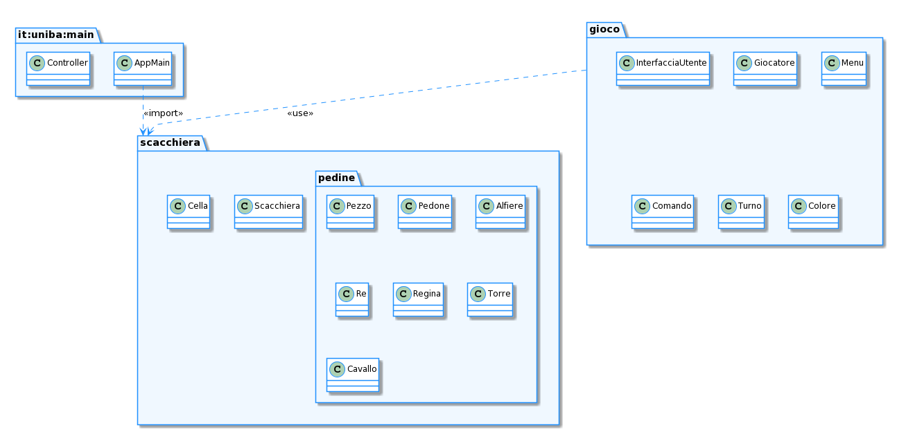

# Report
  

**Indice**
1. [Introduzione](#intro)
1. [Modello di dominio](#dom_mod)
1. [Requisiti specifici](#spec_req)
	- [Requisiti funzionali](#func_req)
	- [Requisiti non funzionali](#not_func_req)
1. [System Design](#sys_des)
	- [Stile architetturale adottato (opzionale)](#arch_style)
	- [Diagramma dei package, diagramma dei componenti (opzionali)](#pkg_cmpnts_diag)
	- [Commentare le decisioni prese (opzionale)](#comments1)
1. [OO Design](#oo_design)
	- [Diagrammi delle classi e diagrammi di sequenza *(per le user story considerate più importanti)*](#class_seq_diag)
	- [Menzionare l'eventuale applicazione di design pattern *(opzionale)*](#design_patt)
	- [Commentare le decisioni prese *(opzionale)*](#comments2)
1. [Riepilogo del test](#test_recap)
	- [Riportare la tabella riassuntiva di coveralls (o jacoco), con dati sul numero dei casi di test e copertura del codice](#coverall_stats)
1. [Manuale utente](#user_man)
1. [Processo di sviluppo e organizzazione del lavoro](#dev_proc)
1. [Analisi retrospettiva](#retro_analysis)
	* [Cosa vi ha fatto sentire soddisfatti e vi ha reso contenti](#happy)
	* [Cosa vi ha fatto sentire insoddisfatti e vi ha deluso](#sad)
	* [Cosa vi ha fatto «impazzire» e vi ha reso disperati](#crazy)

# Introduzione

[Torna all'indice](#indice)

# Modello di dominio

[Torna all'indice](#indice)

# Requisiti specifici

#### Requisiti funzionali

#### Requisiti non funzionali

[Torna all'indice](#indice)
# System Design

#### i.Diagramma dei package

[Torna all'indice](#indice)

# OO Design
#### Diagrammi delle classi e diagrammi di sequenza
##### User story "<titolo>"

#### Menzionare l'eventuale applicazione di design pattern
#### Commentare le decisioni prese

[Torna all'indice](#indice)

# Riepilogo del test
#### Tabella riassuntiva di coveralls (o jacoco), con dati sul numero dei casi di test e copertura del codice

[Torna all'indice](#indice)

# Manuale utente

All'avvio del gioco "Scacchi", viene mostrato il menu principale, con i vari comandi seguiti dalla relativa descrizione testuale.

La navigazione all'interno del menu viene effettuata digitando uno dei comandi
tra quelli visualizzati, seguiti dal tasto  (invio).
Se il comando inserito non è valido / non è tra quelli mostrati, verrà mostrato un messaggio di errore.  
[IMMAGINE]
### Comandi disponibili

Nel gioco degli scacchi esistono due tipologie di comandi:  
* Comandi pre-partita (play, board, help, quit)
* Comandi in-game (play, board, moves, captures, help, quit)

##### Inizio della partita (comando 'Play')
Per iniziare una nuova partita, l'utente dovrà immettere il comando "**play**", e cliccare il tasto  (invio).  
Verrà creata una nuova scacchiera, verranno inseriti i pezzi al suo interno, verranno creati [due nuovi giocatori](#nuovo_giocatore) ed infine il gioco si predisporrà ad ottenere delle mosse in notazione algebrica dal giocatore in turno.  

Nel caso in cui la partita sia già in corso, se digitato il comando 'play', viene chiesta una conferma all'utente se vuole ricominciare il gioco:  
- Se vuole confermare la chiusura del gioco, dovrà cliccare il tasto  seguito dal tasto  (invio)
- Se vorrà ritornare alla normale esecuzione del gioco, l'utente dovrà cliccare il tasto , seguito dal tasto  (invio)

  ######  Creazione di un nuovo giocatore
  Una volta che l'utente avrà digitato il comando "**play**", seguito dal tasto , il gioco chiederà all'utente di inserire i nomi dei due giocatori.  
  L'utente potrà inserire qualunque nome esso preferisca (per convenzione, al primo giocatore verrà assegnato il colore bianco, al secondo giocatore verrà assegnato il colore nero).  
  Una volta terminato l'inserimento del nome del giocatore, premere il tasto  per l'inserimento del nome del giocatore successivo.

  

  Terminata la procedura di inserimento dei nominativi dei due giocatori, si potrà procedere all'inizio della partita vera e propria, con l'[inserimento della prima mossa](prima_mossa)!

##### Visualizzazione della scacchiera (comando "board")
Per visualizzare lo stato della scacchiera, l'utente dovrà immettere il comando "**board**", ed infine premere il tasto .

[IMMAGINE]

Se il comando "**board**" viene digitato prima che la partita cominci (con il comando "**play**") la scacchiera apparirà vuota.

##### Visualizzazione delle catture (comando "captures")

Per visualizzare le catture effettuate sia dal giocatore in turno che da quello in attesa, l'utente dovrà immettere il comando "**captures**", ed infine premere il tasto 

[INSERIRE IMMAGINE]

##### Visualizzazione dello storico delle mosse (comando "moves")  

Per visualizzare uno storico di tutte le mosse effettuate da entrambe i giocatori, l'utente dovrà immettere il comando "**moves**", ed infine premere il tasto 

[INSERIRE IMMAGINE]

**N.B.**: Le mosse sono scritte in notazione algebrica, e nello specifico a sinistra sono riportate le mosse del giocatore con i pezzi di colore bianco, a destra quelle del giocatore con i pezzi di colore nero.
##### Visualizzazione dei comandi disponibili (comando "help")

Per visualizzare tutti i comandi con la relativa descrizione, l'utente dovrà immettere il comando "**help**", ed infine premere il tasto 

##### Chiusura del gioco (comando "quit")

Per ritornare al sistema operativo, l'utente dovrà immettere il comando "**quit**", dove gli verrà chiesta una conferma di chiusura:
- Se l'utente vuole confermare la chiusura del gioco, bisognerà cliccare il tasto  seguito dal tasto  (invio)
- Se l'utente vorrà ritornare alla normale esecuzione del gioco, l'utente dovrà cliccare il tasto , seguito dal tasto  (invio)

### Inserimento di una mossa di gioco

Successivamente all'inserimento dei nomi dei due giocatori, viene richiesto all'utente in turno (per convenzione inizia a muovere il giocatore con il colore bianco) l'inserimento di una mossa in [notazione algebrica](https://it.wikipedia.org/wiki/Notazione_algebrica).

###  Torre 

La torre può avanzare o catturare in una delle case che si trovano lungo la colonna o la traversa sulla quale si trova.

Esistono due tipologie di mosse per la torre: avanzata e cattura.

##### Avanzata

Per effettuare una mossa di avanzata, la casa di destinazione della torre non deve essere occupata da alcun pezzo. Sono considerate mosse illegali le mosse effettuate su stessa traversa e stessa colonna del pezzo che si vuole spostare  

Es. se una torre bianca si trova in a1, e l'utente inserisce la mossa Ta1, verrà stampato a video il messaggio "Mossa illegale."

Per far avanzare la torre, alla richiesta dell'inserimento della mossa l'utente deve inserire l'iniziale del pezzo **in maiuscolo** (T), seguito dalla colonna (lettera da a ad h **in minuscolo**) e dalla traversa (numero da 1 ad 8) della casa di destinazione.

Esempi:  
Se si vuole fare avanzare la torre bianca da a1 ad a3 (pre-condizioni permettendo), l'utente dovrà inserire la mossa `Ta3`.   	

Se si vuole fare avanzare la torre nera da f5 ad h5, l'utente dovrà inserire la mossa `Th5`.

##### Cattura di un pezzo avversario

Per effettuare una cattura, la casa di destinazione della torre deve contenere un pezzo avversario, e le case che attraversa la torre non devono essere occupate da alcun pezzo.

La mossa di cattura viene fatta digitando l'iniziale della torre (**T**), seguita dal carattere 'x' (in minuscolo) **o** dal carattere ':' (due punti), seguita dalla colonna e dalla traversa di destinazione del pezzo da catturare.

Esempi:
`Txf7`, `Th5`

#### Ambiguità possibili
Durante il gioco è possibile che si verifichino delle situazioni di ambiguità fra **due torri dello stesso colore**.
Qui di seguito elenchiamo le possibili combinazioni:

##### Ambiguità "ad L"

In questa ambiguità una delle due torri potrebbe avanzare sulla colonna e l'altra sulla traversa.
L'ambiguità vera e propria si individua sulla casa intersecata dalle due traiettorie.
Per disambiguare, l'utente dovrà inserire la seguente mossa:
lettera T (in maiuscolo),seguita dalla colonna (lettera compresa tra a ed h)di partenza della torre da disambiguare, dalla colonna (lettera compresa tra a ed h) e dalla traversa (numero compreso tra 1 e 8) di destinazione.RIVEDERE SE ANCHE TRAVERSA

 Ambiguità "ad L"

Nella foto di esempio, è possibile disambiguare le torri bianche inserendo la mossa T1a3 (se si vuole spostare la torre in a1, altrimenti T3a3)

Quando si crea un'ambiguità di questo tipo è possibile disambiguare le torri coinvolte inserendo la traversa di partenza della torre che si vuole muovere.

##### Due torri su una stessa colonna

 1° torre in a3, 2° torre bianca in a1.

La seguente ambiguità può crearsi solo dopo la risoluzione di un'ambiguità "ad elle".

Quando si crea un'ambiguità di questo tipo è possibile disambiguare le torri coinvolte inserendo la traversa di partenza della torre che si vuole muovere.

Nella foto di esempio, la ambiguità viene risolta inserendo la mossa T1a2 oppure T3a3

##### Due torri su una stessa traversa

 1° torre in a3, 2° torre bianca in h3.

La seguente ambiguità può crearsi solo dopo la risoluzione di un'ambiguità "ad elle".

Nella foto di esempio, la ambiguità viene risolta inserendo la mossa Tae3 oppure The3.

---

###  Alfiere 

L'alfiere può avanzare, o in alternativa catturare, nelle quattro diagonali disponibili, ovvero:
* nella casa in alto a destra rispetto a quella iniziale
* nella casa in alto a sinistra rispetto a quella iniziale
* nella casa in basso a destra rispetto a quella iniziale
* nella casa in basso a sinistra rispetto a quella iniziale

di quante case desidera.

##### Avanzata dell'alfiere

Per effettuare un'avanzata dell'alfiere, l'utente dovrà immettere una mossa nel seguente formato:

lettera 'A' (in **maiuscolo**), seguita dalla colonna (lettera compresa tra 'a' ed 'h' **in minuscolo**) e dalla traversa della casa di destinazione (numero compreso tra 1 ed 8).  
Infine premere il tasto  (invio).

Esempi di un'avanzata dell'alfiere: `Ad3`, `Ag7`

##### Cattura effettuata con l'alfiere

Per effettuare una cattura con l'alfiere, l'utente dovrà immettere una mossa nel seguente formato:

lettera 'A' (in **maiuscolo**), seguita dal carattere '*x*' (in **minuscolo**) o dal carattere ':' (due punti), seguita dalla colonna (lettera compresa tra 'a' ed 'h' **in minuscolo**) e dalla traversa della casa di destinazione (numero compreso tra 1 ed 8) su cui sarà presente il pezzo avversario da catturare.  
Infine premere il tasto  (invio).

Esempi di mosse di cattura effettuate con l'alfiere: `Axe8`, `Axb1`

---

###   Cavallo 

Il cavallo può avanzare in una serie di mosse che ricorda la lettera maiuscola 'L'.
Le possibili combinazioni sono:
* una casa in avanti o indietro seguita da due case:
  * a destra oppure
  * a sinistra
* una casa a destra o a sinistra seguita da due case:
  * avanti oppure
  * indietro

##### Avanzata del cavallo

Per effettuare un'avanzata del cavallo, l'utente dovrà immettere una mossa nel seguente formato:

lettera 'C' (in **maiuscolo**), seguita dalla colonna (lettera compresa tra 'a' ed 'h' **in minuscolo**) e dalla traversa della casa di destinazione (numero compreso tra 1 ed 8).  
Infine premere il tasto  (invio).

Esempi di un'avanzata del cavallo: `Cc4`, `Cf7`

##### Cattura effettuata con il cavallo

Per effettuare una cattura con il cavallo, l'utente dovrà immettere una mossa nel seguente formato:

lettera C (in **maiuscolo**), seguita dal carattere '*x*' (in **minuscolo**) o dal carattere ':' (due punti), seguita dalla colonna (lettera compresa tra 'a' ed 'h' **in minuscolo**) e dalla traversa della casa di destinazione (numero compreso tra 1 ed 8).  
Infine premere il tasto  (invio).

#### Ambiguità possibili
Essendo il cavallo un pezzo che può generare ambiguità, elenchiamo le possibili ambiguità e come disambiguarle:

##### Due cavalli su colonne differenti che vogliono raggiungere la stessa traversa

Per disambiguare il cavallo che si vuole muovere, basterà inserire la colonna di partenza del pezzo.
Il formato della mossa da inserire sarà il seguente:
lettera C (in **maiuscolo**) seguita dalla colonna di partenza del pezzo (lettera compresa tra 'a' ed 'h' **in minuscolo**), (seguita dal carattere '*x*' (in **minuscolo**) o dal carattere ':' (due punti) **SOLO** in caso di cattura), seguita dalla colonna (lettera compresa tra 'a' ed 'h' **in minuscolo**) e dalla traversa della casa di destinazione (numero compreso tra 1 ed 8).  
Infine premere il tasto  (invio).

Esempi: `Cac2`, `Cexf4`.

##### Due cavalli su traverse differenti che vogliono raggiungere la stessa colonna

Per disambiguare il cavallo che si vuole muovere, in questo caso basterà inserire la traversa di partenza del pezzo.
Il formato della mossa da inserire sarà il seguente:
lettera C (in **maiuscolo**) seguita dalla traversa di partenza del pezzo (lettera compresa tra 'a' ed 'h' **in minuscolo**), (seguita dal carattere '*x*' (in **minuscolo**) o dal carattere ':' (due punti) **SOLO** in caso di cattura), seguita dalla colonna (lettera compresa tra 'a' ed 'h' **in minuscolo**) e dalla traversa della casa di destinazione (numero compreso tra 1 ed 8).  
Infine premere il tasto  (invio).

Esempi: `C8g6`, `C3xf5`.

---

###  Regina 

La regina (anche chiamata Donna) può avanzare o in alternativa catturare lungo la colonna, la traversa o la diagonale sulle quali si trova in un numero indefinito (compreso nei limiti della scacchiera) di case.  

Basti pensare che da una posizione centrale questo pezzo è in grado di raggiungere ben 27 case differenti e ciò rende bene l'idea di come questo sia sicuramente il pezzo più forte.  
Di qui l'attribuzione del nominativo di 'pezzo pesante'.

##### Avanzata della regina

Per effettuare l'avanzamento della Regina, l'utente dovrà immettere una mossa nel seguente formato:  
lettera D (in **maiuscolo**), seguita dalla colonna (lettera compresa tra 'a' ed 'h' **in minuscolo**) e dalla traversa della casa di destinazione (numero compreso tra 1 ed 8).
Infine premere il tasto  (invio).

Esempio di un avanzamento della regina: `De4`, `Dh5`

##### Cattura di un pezzo avversario

Per effettuare una mossa di cattura con la Regina, l'utente dovrà immettere la mossa nel seguente formato:  
lettera D (in **maiuscolo**), seguita dal carattere '*x*' (in **minuscolo**) o dal carattere ':' (due punti), seguito dalla colonna (lettera compresa tra 'a' ed 'h' **in minuscolo**) e dalla traversa della casa di destinazione (numero compreso tra 1 ed 8) su cui sarà presente un pezzo avversario.  

Infine premere il tasto  (invio).

Esempio di una cattura effettuata con la regina: `Dxf2`, `Dxg6`

---

###  Re 

Il Re può avanzare di una casa o in alternativa catturare in tutte le case ad esso adiacenti.  
Il Re non può spostarsi in caselle che sono sotto minaccia da parte di un qualunque pezzo avversario.  

##### Avanzata del Re

Per effettuare l'avanzamento del Re, l'utente dovrà immettere una mossa nel seguente formato:  
lettera *'R'* (in **maiuscolo**), seguita dalla colonna (lettera compresa tra 'a' ed 'h' **in minuscolo**) e dalla traversa della casa di destinazione (numero compreso tra 1 ed 8).
Infine premere il tasto  (invio).

Esempio di un avanzamento del Re: `Rc3`, `Rf7`

##### Cattura di un pezzo avversario

Per effettuare una mossa di cattura con il Re, l'utente dovrà immettere la mossa nel seguente formato:  
lettera *'R'* (in **maiuscolo**), seguito dal carattere '*x*' (in **minuscolo**) o dal carattere ':' (due punti), seguito dalla colonna (lettera compresa tra 'a' ed 'h' **in minuscolo**) e dalla traversa della casa di destinazione (numero compreso tra 1 ed 8) su cui sarà presente un pezzo avversario.  

Infine premere il tasto  (invio).

Esempio di una cattura effettuata con il Re: `Rxf2`, `Rxg6`

---

###  Pedone 

*(a) Potenziali movimenti pedone* 

Il pedone si può muovere sulla colonna avanzando, e solo avanzando, di una sola casa.  
Nella prima mossa che effettua, può decidere se avanzare di due case, in tutte le altre situazioni avanza sempre di una casa sulla stessa colonna.  

Il pedone si può muovere su una casa posta diagonalmente di fronte ad esso su una colonna adiacente, esclusivamente nel caso in cui tale casa sia occupata da un pezzo avversario e quindi trattasi di cattura.

##### Avanzata del pedone
Per effettuare l'avanzamento del pedone, l'utente dovrà immettere una mossa nel seguente formato:  
colonna (lettera compresa tra 'a' ed 'h' **in minuscolo**) e traversa della casa di destinazione (numero compreso tra 1 ed 8).
Infine premere il tasto  (invio).

Esempi di avanzata del pedone: `a4`, `f6`

##### Cattura di un pezzo avversario

Per effettuare una cattura con un pedone, l'utente deve inserire la colonna di partenza del pedone (lettera da a ad h in **minuscolo**), seguita dal carattere 'x' (in minuscolo) **o** dal carattere ':' (due punti), seguita dalla colonna e dalla traversa di destinazione del pezzo da catturare.  
Infine premere il tasto  (invio).

Esempi di cattura con il pedone:
`a4`, `f6`

---

#### Mossa speciale: Cattura en passant

Un pedone che occupi la casa nella stessa traversa e sulla colonna adiacente di un pedone
avversario il quale sia appena stato avanzato di due case dalla sua casa d’origine, può catturare il pedone avversario come se quest’ultimo fosse stato avanzato di una sola casa.
Questa cattura è legale solo nella mossa immediatamente successiva al suddetto avanzamento ed è detta cattura *en passant* ("al varco").

[Immagine]
*(h) En passant*

Per effettuare la cattura en passant l'utente dovrà inserire la colonna di partenza del pedone (in **minuscolo**), seguito dalla casa adiacente alla sua, ovvero quella occupata da un pedone avversario.

Esempi di catture en passant validi (previe condizioni soddisfatte):
`axb6`, `fxe3`.

#### Mossa speciale: Arrocco

Una mossa straordinaria è quella dell' *Arrocco*, che coinvolge Re e Torre dello stesso colore.  
Con l'immissione della mossa dell'arrocco, il Re viene trasferito dalla casa di partenza a quella che si trova 2 (se il tipo di
arrocco è '*corto*') o 3 case (se il tipo di arrocco è '*lungo*') a sinistra (in caso il colore del giocatore in turno sia il **bianco**) o a destra (in caso il colore del giocatore in turno sia il **nero**).  
Viceversa, la torre viene trasferita sulla casa che il Re ha appena attraversato, ovvero 2 case (in caso di arrocco '*corto*') o 3 case (in caso di arrocco '*lungo*') a sinistra (se il giocatore in turno ha il colore **nero**) o a destra (se il giocatore in turno ha il colore **bianco**).

 Fig. *(a)*

Nella figura *(a)* è rappresentato l'arrocco corto per i pezzi neri, mentre quello lungo per i pezzi bianchi

Questa mossa si può eseguire solo se sono soddisfatte determinate condizioni:
* il Re e la torre del colore del giocatore che chiama l'arrocco non si sono mai mossi
* la casa su cui si trova il Re, quella che andrà ad occupare e quelle che attraverserà non siano esposte a cattura
* Il Re non può arroccare se si trova sotto scacco
* La casa che il Re scavalca per arroccare non deve essere sotto minaccia di un pezzo avversario (cioè il re non può attravesare uno scacco)
* Il Re non deve mettersi sotto scacco effettuando l'arrocco.

Per effettuare la mossa dell'arrocco l'utente dovrà immettere:   
* `0-0` (zero trattino zero) se vuole effettuare l'arrocco corto
* `0-0-0` (zero trattino zero trattino zero) se vuole effettuare l'arrocco lungo  
seguita infine da un  (invio).

P.S. Il gioco accetta anche le seguenti mosse:  
* `o-o` / `o-o-o` (dove i caratteri diversi dai trattini sono delle o minuscole)
* `O-O` / `O-O-O` (dove i caratteri diversi dai trattini sono delle o maiuscole)

---

[Torna all'indice](#indice)

# Processo di sviluppo e organizzazione del lavoro

[Torna all'indice](#indice)

# Analisi retrospettiva
#### Cosa vi ha fatto sentire soddisfatti e vi ha reso contenti
#### Cosa vi ha fatto sentire insoddisfatti e vi ha deluso
#### Cosa vi ha fatto «impazzire» e vi ha reso disperati

[Torna all'indice](#indice)
